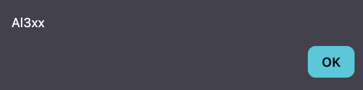
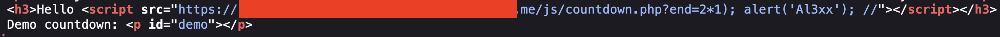

## Introduction

This lab looked simple at first: a classic reflected XSS.  
The twist was **Content Security Policy (CSP)**. My goal wasn't just to inject JavaScript, but to **actually execute it despite CSP**.

The challenge forced me to stop thinking in "payloads" and start thinking in **execution paths**.

## Reconnaissance

I started by browsing the application normally and watching how user input was handled.

I quickly noticed a `name` parameter reflected directly into the page:

```text
/?name=hacker
```

That's always my first stop.

Naturally, I tried a basic XSS payload:

```text
<script>alert(1)</script>
```

The script tag appeared in the page source, but nothing executed.

That was my first signal to check the response headers.

The CSP header stood out immediately:

```http
Content-Security-Policy:
default-src 'self';
script-src 'self' https://redacted.com
```

So inline scripts were blocked, but scripts **hosted on the same origin** were allowed.

That changed the approach completely.

## Exploitation

Since I couldn't run inline JavaScript, I needed a **JavaScript file on the same domain** that I could control.

I started enumerating routes and found this endpoint:

```js
/js/countdown.php?end=2534926825
```

When I opened it directly, it returned raw JavaScript.

Even better: the `end` parameter was injected straight into the JS logic **without sanitization**.

At that point, the plan was clear:

1. Inject JavaScript into `countdown.php`

2. Load that file via `<script src="">`

3. Let CSP do the rest for me

I crafted a payload that:

- Closed the original JavaScript expression

- Executed my own `alert`

- Commented out the rest to avoid syntax errors

Final payload (URL-encoded in the browser):

```js
<script src="/js/countdown.php?end=2*1); alert('Al3xx'); //"></script>
```

When the page loaded, the alert popped instantly.




