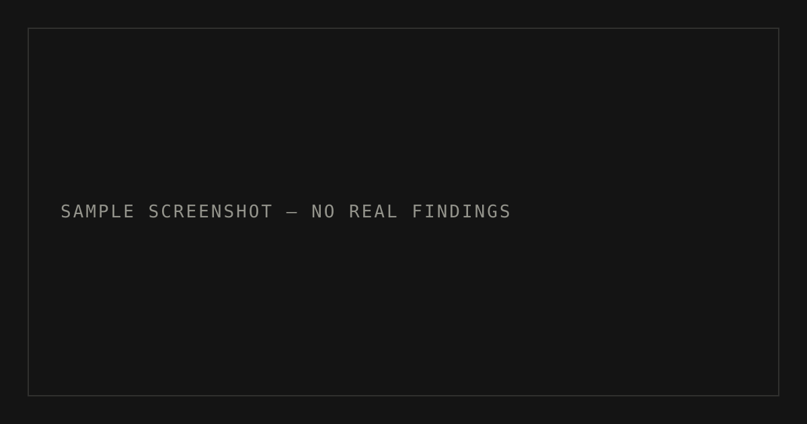

This is **SAMPLE content**, not a record of the owner's work or a real walkthrough. Publish writeups only for retired machines.

## Context

This example shows that a writeup can use any heading structure that fits the work. Replace it with a real, cleared writeup before publishing.

## Enumeration

The command below is illustrative only and targets a documentation address.

```bash
nmap -sC -sV 192.0.2.10
```

## Evidence



*SAMPLE screenshot placeholder. Replace with a relevant screenshot and meaningful alt text.*

## Lessons learned

TODO(owner): Replace this sample with your own technical explanation.
